.. sectnum::

Open Charge Point Protocol

Interface description between Charge Point and Central System

+----+----+----+
+----+----+----+

+-------------------------+---------------+
| Document Identifier     | 010.030.007   |
+=========================+===============+
| Document Version        | 1.5           |
+-------------------------+---------------+
| Document Status         | FINAL         |
+-------------------------+---------------+
| Document Release Date   | 8-6-2012      |
+-------------------------+---------------+

Current copyright e-laad.nl 2010, 2011, 2012

All rights reserved. This document is protected by international
copyright law and may not be reprinted, reproduced, copied or utilized
in whole or in part by any means including electronic, mechanical, or
other means without the prior written consent of e-laad.nl.

Version management by OCPP Steering Group.

**Version History**

+---------------+--------------+-------------------+----------------------------------------------------------------------------------------------------------------------------------------+
| **Version**   | **Date**     | **Author**        | **Description**                                                                                                                        |
+===============+==============+===================+========================================================================================================================================+
| 1.0           | 19.10.2010   | Franc Buve        | Final version approved by e-laad.nl. Identical to version 0.12.                                                                        |
+---------------+--------------+-------------------+----------------------------------------------------------------------------------------------------------------------------------------+
| 1.1           | 17.11.2010   | Franc Buve        | Removed change marks.                                                                                                                  |
+---------------+--------------+-------------------+----------------------------------------------------------------------------------------------------------------------------------------+
| 1.2           | 21.02.2011   | Franc Buve        | #302: Added lengths to string types.                                                                                                   |
|               |              |                   | #171: typographic error fixed.                                                                                                         |
+---------------+--------------+-------------------+----------------------------------------------------------------------------------------------------------------------------------------+
| 1.3           | 16.01.2012   | Franc Buve        | Draft for review by OCPP working group. Includes:                                                                                      |
|               |              |                   |                                                                                                                                        |
|               |              |                   | | CR-01 Authentication/authorisation lists                                                                                             |
|               |              |                   | | CR-02 Interval meter readings                                                                                                        |
|               |              |                   | | CR-03 Charge point reservation                                                                                                       |
|               |              |                   | | CR-04 Generic data transfer                                                                                                          |
|               |              |                   | | CR-05 More detailed status notifications                                                                                             |
|               |              |                   | | CR-06 Query configuration parameters                                                                                                 |
|               |              |                   | | CR-07 Timestamp in BootNotification mandatory                                                                                        |
|               |              |                   | | CR-08 Response to StartTransaction.req with status other than Accepted is not clearly defined                                        |
|               |              |                   | | CR-09 Increase size of firmwareVersion in BootNotification                                                                           |
+---------------+--------------+-------------------+----------------------------------------------------------------------------------------------------------------------------------------+
| 1.4           | 27.02.2012   | Brendan McMahon   | Final draft for approval by OCPP working group. Paragraphs and table rows with significant changes have been marked with a side bar.   |
|               |              | Franc Buve        |                                                                                                                                        |
+---------------+--------------+-------------------+----------------------------------------------------------------------------------------------------------------------------------------+
| 1.5           | 26.03.2012   | Franc Buve        | Incorporated review comments. Specification ready for release.                                                                         |
|               | 01.06.2012   |                   |                                                                                                                                        |
|               |              |                   | Changed type of hash from integer to string[64].                                                                                       |
+---------------+--------------+-------------------+----------------------------------------------------------------------------------------------------------------------------------------+

**Contents**

`1 Scope 9 <#scope>`__

`2 Terminology and Conventions 10 <#terminology-and-conventions>`__

`2.1 Conventions 10 <#_Toc322356329>`__

`2.2 Definitions 10 <#_Toc322356330>`__

`2.3 Abbreviations 10 <#_Toc322356331>`__

`2.4 References 11 <#_Toc322356332>`__

`3 Introduction 12 <#_Toc322356333>`__

`3.1 General views of operation 12 <#_Toc322356334>`__

`3.2 Off-line behaviour 15 <#_Toc322356335>`__

`3.3 Local authorisation list 15 <#_Toc322356336>`__

`3.4 Parent id-tag 16 <#_Toc322356337>`__

`3.5 Reservations 17 <#reservations>`__

`3.6 Vendor-specific data transfer 17 <#_Toc322356339>`__

`3.7 Time zones 17 <#time-zones>`__

`3.8 Case sensitivity 17 <#case-sensitivity>`__

`4 Operations Initiated by Charge Point 18 <#_Toc322356342>`__

`4.1 Authorize 18 <#_Toc322356343>`__

`4.2 Boot Notification 19 <#boot-notification>`__

`4.3 Data Transfer 20 <#_Toc322356345>`__

`4.4 Diagnostics Status Notification
21 <#diagnostics-status-notification>`__

`4.5 Firmware Status Notification 21 <#firmware-status-notification>`__

`4.6 Heartbeat 22 <#heartbeat>`__

`4.7 Meter Values 23 <#meter-values>`__

`4.8 Start Transaction 24 <#_Toc322356350>`__

`4.9 Status Notification 25 <#_Toc322356351>`__

`4.10 Stop Transaction 26 <#_Toc322356352>`__

`5 Operations Initiated by Central System 27 <#_Toc322356353>`__

`5.1 Cancel Reservation 27 <#_Toc322356354>`__

`5.2 Change Availability 28 <#change-availability>`__

`5.3 Change Configuration 29 <#change-configuration>`__

`5.4 Clear Cache 30 <#clear-cache>`__

`5.5 Data Transfer 31 <#data-transfer-1>`__

`5.6 Get Configuration 31 <#get-configuration>`__

`5.7 Get Diagnostics 32 <#get-diagnostics>`__

`5.8 Get Local List Version 33 <#_Toc322356361>`__

`5.9 Remote Start Transaction 34 <#_Toc322356362>`__

`5.10 Remote Stop Transaction 35 <#_Toc322356363>`__

`5.11 Reserve Now 35 <#_Toc322356364>`__

`5.12 Reset 37 <#reset>`__

`5.13 Send Local List 38 <#_Toc322356366>`__

`5.14 Unlock Connector 39 <#_Toc322356367>`__

`5.15 Update Firmware 40 <#update-firmware>`__

`6 Messages 41 <#_Toc322356369>`__

`6.1 Authorize.req 41 <#_Toc322356370>`__

`6.2 Authorize.conf 41 <#_Toc322356371>`__

`6.3 BootNotification.req 41 <#_Toc322356372>`__

`6.4 BootNotification.conf 42 <#_Toc322356373>`__

`6.5 CancelReservation.req 43 <#_Toc322356374>`__

`6.6 CancelReservation.conf 43 <#cancelreservation.conf>`__

`6.7 ChangeAvailability.req 43 <#_Toc322356376>`__

`6.8 ChangeAvailability.conf 44 <#_Toc322356377>`__

`6.9 ChangeConfiguration.req 44 <#_Toc322356378>`__

`6.10 ChangeConfiguration.conf 47 <#_Toc322356379>`__

`6.11 ClearCache.req 47 <#_Toc322356380>`__

`6.12 ClearCache.conf 47 <#_Toc322356381>`__

`6.13 DataTransfer.req 47 <#_Toc322356382>`__

`6.14 DataTransfer.conf 48 <#_Toc322356383>`__

`6.15 DiagnosticsStatusNotification.req
48 <#diagnosticsstatusnotification.req>`__

`6.16 DiagnosticsStatusNotification.conf 48 <#_Toc322356385>`__

`6.17 FirmwareStatusNotification.req 49 <#_Toc322356386>`__

`6.18 FirmwareStatusNotification.conf 49 <#_Toc322356387>`__

`6.19 GetConfiguration.req 49 <#_Toc322356388>`__

`6.20 GetConfiguration.conf 49 <#_Toc322356389>`__

`6.21 GetDiagnostics.req 50 <#_Toc322356390>`__

`6.22 GetDiagnostics.conf 50 <#_Toc322356391>`__

`6.23 GetLocalListVersion.req 51 <#getlocallistversion.req>`__

`6.24 GetLocalListVersion.conf 51 <#getlocallistversion.conf>`__

`6.25 Heartbeat.req 51 <#_Toc322356394>`__

`6.26 Heartbeat.conf 51 <#_Toc322356395>`__

`6.27 MeterValues.req 52 <#_Toc322356396>`__

`6.28 MeterValues.conf 52 <#_Toc322356397>`__

`6.29 RemoteStartTransaction.req 52 <#_Toc322356398>`__

`6.30 RemoteStartTransaction.conf 53 <#_Toc322356399>`__

`6.31 RemoteStopTransaction.req 53 <#_Toc322356400>`__

`6.32 RemoteStopTransaction.conf 53 <#_Toc322356401>`__

`6.33 ReserveNow.req 54 <#_Toc322356402>`__

`6.34 ReserveNow.conf 54 <#_Toc322356403>`__

`6.35 Reset.req 54 <#reset.req>`__

`6.36 Reset.conf 55 <#_Toc322356405>`__

`6.37 SendLocalList.req 55 <#sendlocallist.req>`__

`6.38 SendLocalList.conf 56 <#sendlocallist.conf>`__

`6.39 StartTransaction.req 56 <#_Toc322356408>`__

`6.40 StartTransaction.conf 57 <#_Toc322356409>`__

`6.41 StatusNotification.req 57 <#_Toc322356410>`__

`6.42 StatusNotification.conf 58 <#_Toc322356411>`__

`6.43 StopTransaction.req 58 <#_Toc322356412>`__

`6.44 StopTransaction.conf 59 <#_Toc322356413>`__

`6.45 UnlockConnector.req 60 <#_Toc322356414>`__

`6.46 UnlockConnector.conf 60 <#_Toc322356415>`__

`6.47 UpdateFirmware.req 60 <#_Toc322356416>`__

`6.48 UpdateFirmware.conf 61 <#_Toc322356417>`__

`7 Types 62 <#_Toc322356418>`__

`7.1 AuthorisationData 62 <#authorisationdata>`__

`7.2 AuthorizationStatus 62 <#_Toc322356420>`__

`7.3 AvailabilityStatus 62 <#availabilitystatus>`__

`7.4 AvailabilityType 63 <#availabilitytype>`__

`7.5 CancelReservationStatus 63 <#cancelreservationstatus>`__

`7.6 ChargePointErrorCode 64 <#chargepointerrorcode>`__

`7.7 ChargePointStatus 64 <#chargepointmodel>`__

`7.8 ClearCacheStatus 66 <#chargepointvendor>`__

`7.9 ConfigurationStatus 66 <#configurationstatus>`__

`7.10 DataTransferStatus 66 <#datatransferstatus>`__

`7.11 DiagnosticsStatus 67 <#diagnosticsstatus>`__

`7.12 FirmwareStatus 67 <#firmwarestatus>`__

`7.13 IccidString 68 <#firmwareversion>`__

`7.14 IdTagInfo 68 <#idtaginfo>`__

`7.15 IdToken 68 <#idtoken>`__

`7.16 ImsiString 69 <#imsi>`__

`7.17 KeyValue 69 <#keyvalue>`__

`7.18 Location 69 <#location>`__

`7.19 Measurand 70 <#_Toc322356437>`__

`7.20 MeterValue 71 <#_Toc322356438>`__

`7.21 ReadingContext 72 <#readingcontext>`__

`7.22 NameString 73 <#namestring>`__

`7.23 RegistrationStatus 73 <#registrationstatus>`__

`7.24 RemoteStartStopStatus 73 <#remotestartstopstatus>`__

`7.25 ReservationStatus 74 <#reservationstatus>`__

`7.26 ResetStatus 74 <#resetstatus>`__

`7.27 ResetType 74 <#resettype>`__

`7.28 SerialNumberString 75 <#serialnumberstring>`__

`7.29 TransactionData 75 <#transactiondata>`__

`7.30 UnitOfMeasure 75 <#_Toc322356448>`__

`7.31 UnlockStatus 76 <#unlockstatus>`__

`7.32 UpdateStatus 76 <#updatestatus>`__

`7.33 UpdateType 77 <#updatetype>`__

`7.34 ValueFormat 77 <#_Toc322356452>`__

`7.35 VersionString 77 <#versionstring>`__

`8 Binding to Transport Protocol 78 <#_Toc322356454>`__

`8.1 Charge Box Identity 78 <#_Toc322356455>`__

`8.2 Fault Response 78 <#_Toc322356456>`__

`8.3 Mobile Networks 79 <#_Toc322356457>`__

`8.4 Download Firmware 80 <#_Toc322356458>`__

`8.5 Upload Diagnostics 81 <#_Toc322356459>`__

`8.6 Compression 81 <#_Toc322356460>`__

`8.7 Security 81 <#_Toc322356461>`__

`8.8 WSDL 81 <#_Toc322356462>`__

Scope
=====

This document defines the protocol used between a **Charge Point** and
**Central System**. If the protocol requires a certain action or
response from one side or the other, then this will be stated in this
document.

The specification does not define the communication technology. Any
technology will do, as long as it supports TCP/IP connectivity.

Terminology and Conventions
===========================

Conventions
-----------

The key words “MUST”, “MUST NOT”, “REQUIRED”, “SHALL”, “SHALL NOT”,
“SHOULD”, “SHOULD NOT”, “RECOMMENDED”, “MAY”, and “OPTIONAL” in this
document are to be interpreted as described in [RFC2119].

All sections and appendixes, except “Scope” and “Terminology and
Conventions”, are normative, unless they are explicitly indicated to be
informative.

Definitions
-----------

This section contains the terminology that is used throughout this
document.

+----------------------+------------------------------------------------------------------------------------------------------------------------------------------------------------------------------------------------------------------------------------------------------------------------------------------------------------------------------------------------------------------------------------------------------------------+
| **Central System**   | Charge Point Management System: the central system that manages charge points and has the information for authorizing users for using its charge points.                                                                                                                                                                                                                                                         |
+======================+==================================================================================================================================================================================================================================================================================================================================================================================================================+
| **Charge Point**     | The Charge Point is the physical system where an electric vehicle can be charged. A Charge Point will have one or more connectors.                                                                                                                                                                                                                                                                               |
+----------------------+------------------------------------------------------------------------------------------------------------------------------------------------------------------------------------------------------------------------------------------------------------------------------------------------------------------------------------------------------------------------------------------------------------------+
| **Charge Box**       | A Charge Box is the control unit within a Charge Point. Charge Box and Charge Point are often used interchangeably in this document.                                                                                                                                                                                                                                                                             |
+----------------------+------------------------------------------------------------------------------------------------------------------------------------------------------------------------------------------------------------------------------------------------------------------------------------------------------------------------------------------------------------------------------------------------------------------+
| **Connector**        | The term “Connector”, as used in this specification, refers to an independently operated and managed electrical outlet on a Charge Point. This usually corresponds to a single physical connector, but in some cases a single outlet may have multiple physical socket types and/or tethered cable/connector arrangements to facilitate different vehicle types (e.g. four-wheeled EVs and electric scooters).   |
+----------------------+------------------------------------------------------------------------------------------------------------------------------------------------------------------------------------------------------------------------------------------------------------------------------------------------------------------------------------------------------------------------------------------------------------------+

Abbreviations
-------------

+----------------+----------------------------------------------+
| **EV**         | Electrical Vehicle                           |
+================+==============================================+
| **FTP(S)**     | File Transport Protocol (Secure)             |
+----------------+----------------------------------------------+
| **HTTP(S)**    | HyperText Transport Protocol (Secure)        |
+----------------+----------------------------------------------+
| **ICCID**      | Integrated Circuit Card Identifier           |
+----------------+----------------------------------------------+
| **IMSI**       | International Mobile Subscription Identify   |
+----------------+----------------------------------------------+
| **PDU**        | Protocol Data Unit                           |
+----------------+----------------------------------------------+
| **SOAP**       | Simple Object Access Protocol                |
+----------------+----------------------------------------------+
| **SSL**        | Secure Socket Layer                          |
+----------------+----------------------------------------------+
| **TLS**        | Transport Layer Security                     |
+----------------+----------------------------------------------+
| **URL**        | Uniform Resource Locator                     |
+----------------+----------------------------------------------+
| **WSDL**       | Web Service Definition Language              |
+----------------+----------------------------------------------+

References
----------

+--------------------+-----------------------------------------------------------------------------------------------------------------------------------------------------------------------------------------------+
| **[RFC2119]**      | “Key words for use in RFCs to Indicate Requirement Levels”. S. Bradner. March 1997.\ `*http://www.ietf.org/rfc/rfc2119.txt* <http://http://www.ietf.org/rfc/rfc2119.txt>`__                   |
+====================+===============================================================================================================================================================================================+
| **[SOAP]**         | “SOAP Version 1.2 Part 0: Primer (Second Edition)”. 27 April 2007. `*http://www.w3.org/TR/2007/REC-soap12-part0-20070427/* <http://http://www.w3.org/TR/2007/REC-soap12-part0-20070427/>`__   |
+--------------------+-----------------------------------------------------------------------------------------------------------------------------------------------------------------------------------------------+
| **[WS-ADDR]**      | "Web Services Addressing 1.0", `*http://www.w3.org/2005/08/addressing* <http://http://www.w3.org/2005/08/addressing>`__                                                                       |
+--------------------+-----------------------------------------------------------------------------------------------------------------------------------------------------------------------------------------------+
| **[SOAP-SCEN]**    | "SOAP Version 1.2 Usage Scenarios", `*http://www.w3.org/TR/xmlp-scenarios/#S23* <http://http://www.w3.org/TR/xmlp-scenarios/#S23>`__                                                          |
+--------------------+-----------------------------------------------------------------------------------------------------------------------------------------------------------------------------------------------+

Introduction
============

This is the specification for OCPP version 1.5. Significant changes with
respect to version 1.2 have been marked with change bars.

This document describes a standard open protocol for communication
between charge points and a central system. The control unit inside a
charge point is referred to as a Charge Box; the central system as
Central System.

Some basic concepts are explained in the sections below in this
introductory chapter. Chapter 4 and 5 describe the operations supported
by the protocol. The exact messages and their parameters are detailed in
chapter 6 and data types are described in chapter 7.

The protocol is designed to be implemented with SOAP over HTTP. See
chapter 8 for more details.

General views of operation
--------------------------

This section is informative.

The following figures describe the general views of the operations
between Charge Box and Central System for two cases:

1) a Charge Box requesting authentication of a card and sending charge
   transaction status,

2) Central System requesting a Charge Box to update its firmware.

The arrow labels in the following figures indicate the PDUs exchanged
during the invocations of the operations. These PDUs are defined in
detail in chapter `6 <#BKM_6BAEC1BE_8CFF_4D83_87D6_BE437D1ED523>`__.

|image0|

Figure: Example of starting and stopping a transaction

When a Charge Box needs to charge an electric vehicle, it needs to
authenticate the user first before the charging can be started. If the
user is authorized the Charge Box informs the Central System that it has
started with charging.

When charging is done and a user wishes to unplug the electric vehicle
from the charge point, the Charge Box needs to verify that the user is
either the one that initiated the charging or that the user is in the
same group and thus allowed to terminate the charging. Once authorized,
the Charge Box informs the Central System that the charging has been
stopped.

|image1|

Figure: Example of a firmware upgrade

When a Charge Box needs to be updated with new firmware, then the
Central System informs at which time the Charge Box can start
downloading the new firmware. Once the Charge Box has downloaded and
installed the firmware, it will notify the Central System of the status
for each step. Most likely the Charge Box needs to reboot, if so in that
case, the Charge Box will sent a boot notification containing the new
information about the installed firmware.

Off-line behaviour
------------------

This section is normative.

Data communication between Charge Box and Central System will in most
cases be done by means of wireless communication (e.g. GPRS, UMTS). In
the event of unavailability of the communications or even of the Central
System, the Charge Box is designed to operate stand-alone. It MAY
authorise identifiers using its local authorisation list. Charge Box
SHALL queue start and stop requests that need to be sent to the Central
System and transmit these requests in order as soon as the connection to
the Central System is restored. In such cases the Central System will
not be aware that these are queued requests (other than by inference
given that the various timestamps are significantly in the past) – it
will process these as any other requests.

This off-line behaviour of Charge Box is the reason that Central System
SHALL always accept a ‘start transaction’ request. It cannot refuse it,
because the transaction may already have taken place off-line.

Local authorisation list
------------------------

This section is informative.

The local white list of OCPP version 1.2 that serves to cache previously
authorized id-tags has been extended to support the concept of a local
authorisation list that can be synchronized with the Central System. The
local authorisation list is still updated with the results of
authorisation, start and stop requests, but in addition to that it can
be synchronised with the Central System to contain the authorisation
status of all tag-ids or a selection of tag-ids. If synchronisation is
not used, the local authorisation list will exhibit the same behaviour
as the former local white list.

In order to support the above-mentioned off-line behaviour the Charge
Box may implement a local authorisation list that can cache authorized
id-tags and can be synchronised with the Central System. In response to
an authorisation, start or stop transaction request Central System will
return parent-id, expiry-date and an authorisation status that Charge
Box uses to update its local authorisation list. This is the caching
mechanism.

Additionally, the Central System can synchronise this list by either (1)
sending a complete list of id-tags to replace the local authorisation
list or (2) by sending a list of changes (add, update, delete) to apply
to the local authorisation list. The new operations to support this are
`Get Local List Version <#_Get_Local_List>`__ and `Send Local
List <#_Update_Local_List>`__.

|image2|

|image3|

Parent id-tag
-------------

This section is informative.

Central System has the ability to group id-tags, thus allowing one
id-tag in a group to start a transaction and another id-tag in the same
group to stop the transaction. Id-tags are grouped by appointing one
id-tag in the group to be the parent. The value of parent-id-tag of
every id-tag (including the parent) in the group is set to the value of
this ‘parent’ id-tag. Two id-tags are considered to be in the same group
when their parent-id-tags match.

Reservations
------------

This section is informative.

Reservation of a charge point is possible using the Reserve Now
operation. This operation reserves the charge point until a certain
expiry time for a specific id-tag. A parent id-tag may be included in
the reservation to support ‘group’ reservations. It is possible to
reserve a specific connector on a charge point or to reserve any
connector on a charge point. A reservation is released when the reserved
id-tag is used on the reserved connector (when specified) or on any
connector (when unspecified) or when the expiry time is reached or when
the reservation is explicitly cancelled.

Vendor-specific data transfer
-----------------------------

This section is informative.

The mechanism of vendor-specific data transfer allows for the exchange
of data or messages not standardized in OCPP . As such, it offers a
framework within OCPP for experimental functionality that may find its
way into future OCPP versions. Experimenting can be done without
creating new (possibly incompatible) OCPP dialects. Secondly, it offers
a possibility to implement additional functionality agreed upon between
specific Central System and Charge Box vendors.

The operation Vendor Specific Data can be initiated either by the
Central System or by the Charge Box.

***IMPORTANT:*** Use this with extreme caution and only for optional
functionality, because it will impact your compatibility with other
systems that do not make use of this option. We recommend mentioning the
usage explicitly in your documentation and/or communication. Please
consider submitting a change request before turning to this option to
add functionality.

Time zones
----------

This section is informative.

OCPP does not prescribe the use of a specific time zone for time values.
However, it is strongly recommended to use UTC for all time values to
improve interoperability between Central Systems and Charge Boxes.

Case sensitivity
----------------

This section is normative.

All strings in messages and enumerations are case sensitive, unless
explicitly stated otherwise. String elements that are case insensitive
will be of type ‘CiString’.

Operations Initiated by Charge Point
====================================

Authorize
---------

|image4|

Before the owner of an electric vehicle can start or stop charging, the
Charge Box needs to be able to authorize the operation. Only after
authorisation will Charge Box unlock the connector. Note: Stopping a
charge transaction needs only to be authorized when the user stopping
the transaction is different than the user that started the transaction.

A Charge Box MAY cache previously authorized identifiers in the local
authorisation list and MAY use these to authorize a user. If the
identifier is not present in the local authorisation list, then the
Charge Box SHALL send a `*Authorize.req* <#_Authorize.req>`__ PDU to the
Central System for requesting authorisation. If the identifier is
present in the local authorisation list, then Charge Box MAY omit the
sending of an authorisation request to the Central System and use the
authorisation value of the local authorisation list instead.

Upon receipt of an Authorize.req PDU, the Central System SHALL respond
with an `*Authorize.conf* <#_BootNotification.conf>`__ PDU. This
response PDU SHALL indicate, whether or not the id-tag is accepted by
the Central System. If the Central System accepts the id-tag then the
response PDU MAY include a parent-id-tag and MUST include an
authorisation status value indicating acceptance or a reason for
rejection.

Boot Notification
-----------------

|image5|

After start-up a Charge Box sends a notification to the Central System
with information about its configuration (e.g. version, vendor, etc.).
The Central System will only accept Charge Boxes that are registered
with the Central System.

The Charge Box SHALL send a
`*BootNotification.req* <#_BootNotification.req>`__ PDU each time it
(re-)boots.

Upon receipt of a BootNotification.req PDU, the Central System SHALL
respond with a `*BootNotification.conf* <#_ChangeAvailability.conf>`__.
The response PDU SHALL indicate whether the Central System accepts the
Charge Box. When the Central System is willing to accept the Charge Box,
then the response PDU SHALL contain the Central System’s current time
and heartbeat interval.

Upon receipt of a BootNotification.conf PDU, the Charge Box SHALL keep
sending a BootNotification.req PDU when the Central System doesn’t
accept it. The Charge Box SHOULD use an acceptable interval for
resending a BootNotification.req PDU, to avoid flooding the Central
System.

The Charge Box SHALL NOT send any other request other than
BootNotifcation.req until the Central System accepts the Charge Box.

Data Transfer
-------------

|image6|

If a Charge Box needs to send information to the Central System for a
function not supported by OCPP, it SHALL use the
`DataTransfer.req <#_DataTransfer.req>`__ PDU.

The vendorId in the request SHOULD be known to the Central System and
uniquely identify the vendor-specific implementation. The VendorId
SHOULD be a value from the reversed DNS namespace, where the top tiers
of the name, when reversed, should correspond to the publicly registered
primary DNS name of the Vendor organisation.

Optionally, the messageId in the request PDU MAY be used to indicate a
specific message or implementation.

The length of data in both the request and response PDU is undefined and
should be agreed upon by all parties involved.

If the recipient of the request has no implementation for the specific
vendorId it SHALL return a status ‘UnknownVendor’ and the data element
SHALL not be present. In case of a messageId mismatch (if used) the
recipient SHALL return status ‘UnknownMessageId’. In all other cases the
usage of status ‘Accepted’ or ‘Rejected’ and the data element is part of
the vendor-specific agreement between the parties involved.

Diagnostics Status Notification
-------------------------------

|image7|

Charge Box sends a notification to inform the Central System when a
diagnostics upload has finished.The Charge Box SHALL send a
`*DiagnosticsStatusNotifcation.req* <#_DiagnosticsStatusNotification.req>`__
PDU to inform the Central System that the upload of diagnostics has
finished successfully or failed.

Upon receipt of a DiagnosticsStatusNotifcation.req PDU, the Central
System SHALL respond with a
`*DiagnosticsStatusNotifcation.conf* <#_FirmwareStatusNotification.conf>`__.

Firmware Status Notification
----------------------------

|image8|

A Charge Box sends notifications to inform the Central System about the
progress of the firmware update. The Charge Box SHALL send a
`*FirmwareStatusNotifcation.req* <#_FirmwareStatusNotification.req>`__
PDU for informing the Central System about the progress of the
installation of a firmware update.

Upon receipt of a FirmwareStatusNotifcation.req PDU, the Central System
SHALL respond with a
`*FirmwareStatusNotifcation.conf* <#_GetDiagnostics.conf>`__.

Heartbeat
---------

|image9|

To let the Central System know that a Charge Point is still connected, a
Charge Box sends a heartbeat after a configurable time interval.

The Charge Box SHALL send a `*Heartbeat.req* <#_Heartbeat.req>`__ PDU
for ensuring that the Central System knows that a Charge Box is still
alive.

Upon receipt of a Heartbeat.req PDU, the Central System SHALL respond
with a `*Heartbeat.con* <#_Toc314319791>`__\ f. The response PDU SHALL
contain the current time of the Central System, which could be used by
the Charge Box to synchronize its internal clock.

The Charge Box MAY skip sending a Heartbeat.req PDU when another PDU has
been sent to the Central System within the configured heartbeat
interval. This implies that a Central System SHOULD assume availability
of a Charge Box whenever a PDU has been received, the same way as it
would have, when it received a Heartbeat.req PDU.

Meter Values
------------

|image10|

A Charge Box MAY sample the electricity meter or other sensor/transducer
hardware to provide extra information about its meter values. It is up
to the Charge Box to decide when it will send meter values. This can be
configured using the
`ChangeConfiguration.req <#_ChangeConfiguration.req_1>`__ message to
data acquisition intervals and specify data to be acquired & reported.

The Charge Box SHALL send a `*MeterValues.req* <#_MeterValues.req>`__
PDU for offloading meter values. The request PDU SHALL contain for each
sample:

1. The id of the Connector from which samples were taken. A value of
   zero is used when samples are not associated with a specific
   Connector.

2. The transaction id of the transaction to which these values are
   related, if applicable. If there is no transaction in progress or if
   the values are taken from the main meter, then transaction id may be
   omitted.

3. One or more **values** elements, of type
   `**MeterValue** <#_MeterValue_1>`__ (see below), each representing a
   set of one or more data values taken at a particular point in time.

Each **values** element contains a timestamp and a set of one or more
individual **value** elements, all captured at the same point in time.
Each **value** element contains a single value datum. The nature of each
**value** is determined by the optional **measurand**, **context**,
**location**, **unit**, and **format** attributes.

The optional **measurand** attribute specifies the type of value being
measured/reported.

The optional **context** attribute specifies the reason/event triggering
the reading.

The optional **location** attribute specifies where the measurement is
taken (e.g. Inlet, Outlet).

The **EXPERIMENTAL** optional **format** attribute specifies whether the
data is represented in the normal (default) form as a simple numeric
value (“**Raw”**), or as “\ **SignedData**\ ”, an opaque digitally
signed binary data block, represented as hex data. This experimental
attribute may be deprecated and subsequently removed in later versions,
when a more mature solution alternative is provided.

To retain backward compatibility, the default values of all of the
optional attributes on a **value** element are such that a **value**
without any attributes will be interpreted, as heretofore, as a register
reading of active import energy in Wh (Watt-hour) units.

Upon receipt of a MeterValues.req PDU, the Central System SHALL respond
with a `*MeterValues.conf* <#_RemoteStartTransaction.conf>`__.

Start Transaction
-----------------

|image11|

When an electric vehicle is allowed to start charging, the Charge Box
needs to inform the Central System about this.

The Charge Box SHALL send a
`*StartTransaction.req* <#_StartTransaction.req>`__ PDU to the Central
System to inform it about the start of a charging transaction. If this
transaction ends a reservation (see `Reserve Now <#_Reserve_Now>`__
operation), then the StartTransaction.req MUST contain the
reservationId.

The Central System MUST verify validity of the transaction, because the
identifier might have been authorized locally by the Charge Box using an
out-of-date white list. The identifier, for instance, may have been
blocked since it was added to the local white list.

Upon receipt of a StartTransaction.req PDU, the Central System SHALL
respond with a `*StartTransaction.conf* <#_StatusNotification.conf>`__
PDU. This response PDU MUST include a transaction id and an
authorisation status value.

If Charge Box has implemented a local authorisation list, then upon
receipt of a StartTransaction.conf PDU the Charge Box SHALL update the
local list entry with the IdTagInfo value from the response. An
authorisation status value of ‘ConcurrentTx’ SHALL be replaced by
‘Accepted’ in the local authorisation list.

Status Notification
-------------------

|image12|

A Charge Box sends a notification to the Central System to inform the
Central System about a status or error condition within the Charge Box.
The Charge Box SHALL send an
`*StatusNotification.req* <#_StatusNotification.req>`__ PDU when it
becomes unavailable as result of an error condition or a scheduled
`*Change Availability* <#_Change_Availability>`__ command. The Charge
Box MAY send an StatusNotification.req PDU to inform the Central System
of other error conditions.

Upon receipt of an StatusNotification.req PDU, the Central System SHALL
respond with an `*StatusNotification.conf* <#_StopTransaction.conf>`__.

Stop Transaction
----------------

|image13|

When an electric vehicle is allowed to stop charging; the Charge Box
needs to be able to inform the Central System about this. The Charge Box
SHALL send a `*StopTransaction.req* <#_StopTransaction.req>`__ PDU when
a transaction needs to be stopped. A transaction MUST be stopped
explicitly by the Charge Box.

Upon receipt of a StopTransaction.req PDU, the Central System SHALL
respond with a `*StopTransaction.conf* <#_UnlockConnector.conf>`__ PDU.
The Central System SHALL always stop the transaction.

A StopTransaction.req PDU MAY contain an optional **TransactionData**
element to provide more detail about transaction usage. The optional
TransactionData element is a container for any number of **values**
(MeterValue datatype) sub-elements, using the same data structure as the
**values** elements of the MeterValues.req PDU (See 4.7.1)

If Charge Box has implemented a local authorisation list, then upon
receipt of a StopTransaction.conf PDU the Charge Box SHALL update the
local list entry with the IdTagInfo value from the response. An
authorisation status value of ‘ConcurrentTx’ SHALL be replaced by
‘Accepted’ in the local authorisation list.

The id-tag in the request PDU MAY be omitted when the Charge Box itself
needs to stop the transaction. For instance, when the Charge Box is
requested to reset.

Operations Initiated by Central System
======================================

Cancel Reservation
------------------

|image14|

To cancel a reservation the Central System SHALL send an
`*CancelReservation.req* <#_CancelReservation.req>`__ PDU to the Charge
Box.

If the Charge Box has a reservation matching the reservationId in the
request PDU, it SHALL return status ‘Accepted’. Otherwise it SHALL
return ‘Rejected’.

Change Availability
-------------------

|image15|

Central System can request a Charge Box to change its availability. A
Charge Box is considered available (“operative”) when it is charging or
ready for charging. A Charge Box is considered unavailable when it does
not allow any charging. The Central System SHALL send a
`*ChangeAvailability.req* <#_ChangeAvailability.req>`__ PDU for
requesting a Charge Box to change its availability. The Central System
can change the availability to available or unavailable.

Upon receipt of a ChangeAvailability.req PDU, the Charge Box SHALL
respond with a
`*ChangeAvailability.conf* <#_ChangeConfiguration.conf>`__ PDU. The
response PDU SHALL indicate whether the Charge Box is able to change to
the requested availability or not. When a transaction is in progress
Charge Box SHALL respond with availability status 'Scheduled' to
indicate that it is scheduled to occur after the transaction has
finished. When that happens Charge Box SHALL inform Central System of
its new availability status with a `*Status
Notification* <#_Status_Notification>`__.

In the event that Central System requests Charge Box to change to a
status it is already in, Charge Box SHALL respond with availability
status ‘Accepted’.

Change Configuration
--------------------

|image16|

Central System can request a Charge Box to change configuration
parameters. To achieve this, Central System SHALL send a
`*ChangeConfiguration.req* <#_ChangeConfiguration.req>`__. This request
contains a key-value pair, where "key" is the name of the configuration
setting to change and "value" contains the new setting for the
configuration setting.

Upon receipt of a ChangeConfiguration.req Charge Box SHALL reply with a
`*ChangeConfiguration.conf* <#_ClearCache.conf>`__ indicating whether it
was able to executed the change. Content of "key" and "value" is not
prescribed. If "key" does not correspond to a configuration setting
supported by Charge Box, it SHALL reply with a status NotSupported.
Otherwise it SHALL indicate success or failure with status Accepted or
Rejected respectively.

Clear Cache
-----------

|image17|

Central System can request a Charge Box to clear its cache. For instance
a Charge Box may cache previously authorized cards in a white list.The
Central System SHALL send a `*ClearCache.req* <#_ClearCache.req>`__ PDU
for clearing the Charge Box’s cache.

Upon receipt of a ClearCache.req PDU, the Charge Box SHALL respond with
a `*ClearCache.conf* <#_Toc314319777>`__ PDU. The response PDU SHALL
indicate whether the Charge Box was able to clear its cache.

Data Transfer
-------------

|image18|

If the Central System needs to send information to a Charge Box for a
function not supported by OCPP, it SHALL use the
`DataTransfer.req <#_DataTransfer.req>`__ PDU.

Behaviour of this operation is identical to the Data Transfer operation
initiated by the Charge Box. See 4.3 Data Transfer for details.

Get Configuration
-----------------

|image19|

To retrieve the value of configuration settings, the Central System
SHALL send a `GetConfiguration.req <#_GetConfigurations.req>`__ PDU to
the Charge Box.

If the list of keys in the request PDU is empty or missing (it is
optional), the Charge Box SHALL return a list of all configuration
settings in `GetConfiguration.conf <#_GetConfigurations.conf>`__.
Otherwise Charge Box SHALL return a list of recognized keys and their
corresponding values and read-only state. Unrecognized keys will be
placed in the response PDU as part of the optional unknown key list
element of GetConfiguration.conf.

Get Diagnostics
---------------

|image20|

Central System can request a Charge Box for diagnostic information.The
Central System SHALL send a
`*GetDiagnostics.req* <#_GetDiagnostics.req>`__ PDU for getting
diagnostic information of a Charge Box with a location where the Charge
Box MUST upload its diagnostic data to and optionally a begin and end
time for the requested diagnostic information.

Upon receipt of a GetDiagnostics.req PDU, and if diagnostics information
is available then Charge Box SHALL respond with a
`*GetDiagnostics.conf* <#_Heartbeat.conf>`__ PDU stating the name of the
file containing the diagnostic information that will be uploaded. Charge
Box SHALL upload a single compressed file. Format of the diagnostics
file is not prescribed. If no diagnostics file is available, then
GetDiagnostics.conf SHALL not contain a file name.

Get Local List Version
----------------------

|image21|

In order to support synchronisation of the local authorisation list,
Central System can request a Charge Box for the version number of the
local authorisation list. The Central System SHALL send a
`*GetLocalListVersion.req* <#_GetDiagnostics.req>`__ PDU to request this
value.

Upon receipt of a GetLocalListVersion.req PDU Charge Box SHALL respond
with a `*GetLocalListVersion.conf* <#_Heartbeat.conf>`__ PDU containing
the version number of its local authorisation list. By convention, a
version number of 0 (zero) is used to indicate that the local
authorisation list is empty, and a version number of -1 is used to
indicate that the Charge Box does not support local authorisation lists.

Remote Start Transaction
------------------------

|image22|

Central System can request a Charge Box to start a transaction by
sending a
`*RemoteStartTransaction.req* <#_RemoteStartTransaction.req>`__. Upon
receipt Charge Box SHALL reply with
`*RemoteStartTransaction.conf* <#_RemoteStopTransaction.conf>`__ and a
status indicating whether it is able to start a transaction or not.

The RemoteStartTransaction.req SHALL contain an identifier (IdTag),
which Charge Box SHALL use, if it is able to start a transaction, to
send a StartTransaction.req to Central System. The transaction is
started in the same way as described in `*Start
Transaction* <#_Start_Transaction>`__. The RemoteStartTransaction.req
MAY contain a connector id if the transaction is to be started on a
specific connector.

Remote Stop Transaction
-----------------------

|image23|

Central System can request a Charge Box to stop a transaction by sending
a `*RemoteStopTransaction.req* <#_RemoteStopTransaction.req>`__ to
Charge Box with the identifier of the transaction. Charge Box SHALL
reply with `*RemoteStopTransaction.conf* <#_Reset.conf>`__ to indicate
whether it is indeed able to stop the transaction.

Reserve Now
-----------

|image24|

A Central System can issue a Reserve Now command to a Charge Box to
reserve a connector for use by a specific id-tag.

To request a reservation the Central System SHALL send a
`*ReserveNow.req* <#_Reset.req>`__ PDU to a Charge Box. The Central
System MAY specify a specific connector to be reserved. Upon receipt of
a ReserveNow.req PDU, the Charge Box SHALL respond with a
`*ReserveNow.conf* <#_ReserveNow.conf_1>`__ PDU.

If the reservationId in the request matches a reservation in the Charge
Box, then the Charge Box SHALL replace that reservation with the new
reservation in the request.

If the reservationId does not match any reservation in the Charge Box,
then the Charge Box SHALL return the status value ‘Accepted’ if it
succeeds in reserving a connector. The Charge Box SHALL return
‘Occupied’ if the Charge Box or the specified connector are occupied.
The Charge Box SHALL also return ‘Occupied’ when the Charge Box or
connector has been reserved for the same or another id-tag. The Charge
Box SHALL return ‘Faulted’ if the Charge Box or the connector are in the
Faulted state. The Charge Box SHALL return ‘Unavailable’ if the Charge
Box or connector are in the Unavailable state. The Charge Box SHALL
return ‘Rejected’ if it is configured not to accept reservations.

If the Charge Box accepts the reservation request, then it SHALL refuse
charging for all incoming id-tags on the reserved connector, except when
the incoming id-tag or the parent id-tag match the id-tag or parent
id-tag of the reservation. If the connectorId in the reservation request
is 0, then the Charge Box SHALL NOT reserve a specific connector, but
SHALL make sure that at any time during the validity of the reservation,
one connector remains available for the reserved id-tag. If the parent
id-tag in the reservation has a value (it is optional), then in order to
determine the parent id-tag that is associated with an incoming id-tag,
the Charge Box MAY look it up in its local cache. If it is not found in
the local cache, then the Charge Box SHALL send an
`Authorize.req <#_Toc314319765>`__ for the incoming id-tag to the
Central System. The Authorize.conf response contains the parent-id.

A reservation will be terminated on the Charge Box when either (1) a
transaction is started for the reserved id-tag or parent id-tag and on
the reserved connector or any connector when the reserved connectorId is
0, or (2) when the time specified in expiryDate is reached, or (3) when
the Charge Box or connector are set to Faulted or Unavailable.

If a transaction for the reserved id-tag is started, then Charge Box
SHALL send the reservationId in the
`StartTransaction.req <#_StartTransaction.req>`__ PDU (see `Start
Transaction <#_Start_Transaction>`__) to notify the Central System that
the reservation is terminated.

When a reservation expires, the Charge Box SHALL terminate the
reservation and make the connector available. Charge Box MAY send a
status notification to notify the Central System that the reserved
connector is now available. This is not obligatory, because the Central
System knows when reservations are due to expire.

Reset
-----

|image25|

The Central System SHALL send a `*Reset.req* <#_Reset.req>`__ PDU for
requesting a Charge Box to reset itself. The Central System can request
a hard or a soft reset. Upon receipt of a Reset.req PDU, the Charge Box
SHALL respond with a `*Reset.conf* <#_StartTransaction.conf>`__ PDU. The
response PDU SHALL indicate whether the Charge Box is willing to reset
itself.

At receipt of a soft reset, Charge Box SHALL return to its basic idle
state. If any transaction is in progress it SHALL be terminated
normally, as in `*Stop Transaction. * <#_Stop_Transaction>`__

At receipt of a hard reset Charge Box SHALL attempt to terminate any
transaction in progress normally as in `*Stop
Transaction* <#_Stop_Transaction>`__ and then perform a reboot.

Send Local List
---------------

|image26|

Central System can send a local authorisation list that a Charge Box can
use for authorisation of id-tags. The list can be either a full list to
replace the current list in the Charge Box or it can be a differential
list with updates to be applied to the current list in the Charge Box.

The Central System SHALL send a
`*SendLocalList.req* <#_UnlockConnector.req>`__ PDU to send the list to
a Charge Box. The SendLocalList.req PDU SHALL contain the type of update
(full or differential) and the version number that the Charge Box MUST
associate with the local authorisation list after it has been updated.

Upon receipt of an SendLocalList.req PDU, the Charge Box SHALL respond
with a `*SendLocalList.conf* <#_UpdateFirmware.conf>`__ PDU. The
response PDU SHALL indicate whether the Charge Box has accepted the
update of the local authorisation list. If the status is Failed or
VersionMismatch and the updateType was Differential, then Central System
SHOULD retry sending the full local authorisation list with updateType
Full.

Both the SendLocalList.re q and SendLocalList.conf PDUs have an optional
element ‘hash’ , that MAY be used to verify proper receipt of the list
by Charge Box and Central System. The computation method of the hash
value is not defined in this version of the specification, but may
become subject to standardisation in the future. The presence of this
hash element is not intended to require or encourage users of this OCPP
version to implement any vendor or deployment specific hashing scheme,
other than those who may be participating in pilot implementations of a
proposed standardized canonical data hashing algorithm for possible
inclusion in a future version release of OCPP.

Unlock Connector
----------------

|image27|

Central System can unlock a connector of a Charge Box. The Central
System SHALL send an `*UnlockConnector.req* <#_UnlockConnector.req>`__
PDU for requesting a Charge Box to unlock one of its connector.

Upon receipt of an UnlockConnector.req PDU, the Charge Box SHALL respond
with a `*UnlockConnector.conf* <#_UpdateFirmware.conf>`__ PDU. The
response PDU SHALL indicate whether the Charge Box was able to unlock
its connector.

If there was a transaction in progress on the specific connector, then
Charge Box SHALL finish the transaction first as described in `*Stop
Transaction* <#_Stop_Transaction>`__.

Update Firmware
---------------

|image28|

Central System can notify a Charge Box that it needs to update its
firmware. The Central System SHALL send an
`*UpdateFirmware.req* <#_UpdateFirmware.req>`__ PDU to inform the Charge
Box about the availability of new firmware. The PDU SHALL contain a date
and time after which the Charge Box is allowed to retrieve the new
firmware and the location from which the firmware can be downloaded.

Upon receipt of an UpdateFirmware.req PDU, the Charge Box SHALL respond
with a `*UpdateFirmware.conf* <#_Toc314319816>`__ PDU. The Charge Box
SHOULD start retrieving the firmware as soon as possible after
retrieve-date.

Messages
========

Authorize.req
-------------

This contains the field definition of the Authorize.req PDU sent by the
Charge Box to the Central System.

+------------------+------------------+-------------+-----------------------------------------------------------------------+
| **Field Name**   | **Field Type**   | **Card.**   | **Description**                                                       |
+==================+==================+=============+=======================================================================+
| **idTag**        | IdToken          | 1..1        | Mandatory This contains the identifier that needs to be authorized.   |
+------------------+------------------+-------------+-----------------------------------------------------------------------+

Authorize.conf
--------------

This contains the field definition of the Authorize.conf PDU sent by the
Central System to the Charge Box as response to a Authorize.req PDU.

+------------------+------------------+-------------+-----------------------------------------------------------------------------------------+
| **Field Name**   | **Field Type**   | **Card.**   | **Description**                                                                         |
+==================+==================+=============+=========================================================================================+
| **idTagInfo**    | IdTagInfo        | 1..1        | Mandatory.This contains information about authorisation status, expiry and parent id.   |
+------------------+------------------+-------------+-----------------------------------------------------------------------------------------+

BootNotification.req
--------------------

This contains the field definition of the BootNotification.req PDU sent
by the Charge Box to the Central System.

+-------------------------------+---------------------------+-------------+----------------------------------------------------------------------------------------------------------------+
| **Field Name**                | **Field Type**            | **Card.**   | **Description**                                                                                                |
+===============================+===========================+=============+================================================================================================================+
| **chargeBoxSerialNumber**     | ChargeBoxSerialNumber     | 0..1        | Optional.This contains a value that identifies the serial number of the Charge Box inside the Charge Point..   |
+-------------------------------+---------------------------+-------------+----------------------------------------------------------------------------------------------------------------+
| **chargePointModel**          | ChargePointModel          | 1..1        | Mandatory. This contains a value that identifies the model of the ChargePoint.                                 |
+-------------------------------+---------------------------+-------------+----------------------------------------------------------------------------------------------------------------+
| **chargePointSerialNumber**   | ChargePointSerialNumber   | 0..1        | Optional.This contains a value that identifies the serial number of the Charge Point.                          |
+-------------------------------+---------------------------+-------------+----------------------------------------------------------------------------------------------------------------+
| **chargePointVendor**         | ChargePointVendor         | 1..1        | Mandatory. This contains a value that identifies the vendor of the ChargePoint.                                |
+-------------------------------+---------------------------+-------------+----------------------------------------------------------------------------------------------------------------+
| **firmwareVersion**           | FirmwareVersion           | 0..1        | Optional. This contains the firmware version of the Charge Box.                                                |
+-------------------------------+---------------------------+-------------+----------------------------------------------------------------------------------------------------------------+
| **iccid**                     | Iccid                     | 0..1        | Optional. This contains the ICCID of the modem's SIM card.                                                     |
+-------------------------------+---------------------------+-------------+----------------------------------------------------------------------------------------------------------------+
| **imsi**                      | Imsi                      | 0..1        | Optional. This contains the IMSI of the modem's SIM card.                                                      |
+-------------------------------+---------------------------+-------------+----------------------------------------------------------------------------------------------------------------+
| **meterSerialNumber**         | MeterSerialNumber         | 0..1        | Optional. This contains the serial number of the main power meter of the Charge Point.                         |
+-------------------------------+---------------------------+-------------+----------------------------------------------------------------------------------------------------------------+
| **meterType**                 | MeterType                 | 0..1        | Optional. This contains the type of the main power meter of the Charge Point.                                  |
+-------------------------------+---------------------------+-------------+----------------------------------------------------------------------------------------------------------------+

BootNotification.conf
---------------------

This contains the field definition of the BootNotification.conf PDU sent
by the Central System to the Charge Box as response to a
BootNotification.req PDU.

+-------------------------+----------------------+-------------+-------------------------------------------------------------------------------------------------+
| **Field Name**          | **Field Type**       | **Card.**   | **Description**                                                                                 |
+=========================+======================+=============+=================================================================================================+
| **currentTime**         | dateTime             | 1..1        | Mandatory. This contains the Central System's current time.                                     |
+-------------------------+----------------------+-------------+-------------------------------------------------------------------------------------------------+
| **heartbeatInterval**   | integer              | 1..1        | Mandatory. This contains the interval in seconds of the heartbeats.                             |
+-------------------------+----------------------+-------------+-------------------------------------------------------------------------------------------------+
| **status**              | RegistrationStatus   | 1..1        | Mandatory.This contains whether the Charge-Box has been registered within the System Central.   |
+-------------------------+----------------------+-------------+-------------------------------------------------------------------------------------------------+

CancelReservation.req
---------------------

This contains the field definition of the CancelReservation.req PDU sent
by the Central System to the Charge Box.

+---------------------+------------------+-------------+-----------------------------------------------+
| **Field Name**      | **Field Type**   | **Card.**   | **Description**                               |
+=====================+==================+=============+===============================================+
| **reservationId**   | integer          | 1..1        | Mandatory. Id of the reservation to cancel.   |
+---------------------+------------------+-------------+-----------------------------------------------+

CancelReservation.conf
----------------------

This contains the field definition of the CancelReservation.conf PDU
sent by the Charge Box to the Central System as response to a
CancelReservation.req PDU.

+------------------+---------------------------+-------------+----------------------------------------------------------------------------------------------------------+
| **Field Name**   | **Field Type**            | **Card.**   | **Description**                                                                                          |
+==================+===========================+=============+==========================================================================================================+
| **status**       | CancelReservationStatus   | 1..1        | Mandatory. This indicates the success or failure of the cancelling of a reservation by Central System.   |
+------------------+---------------------------+-------------+----------------------------------------------------------------------------------------------------------+

ChangeAvailability.req
----------------------

This contains the field definition of the ChangeAvailability.req PDU
sent by the Central System to the Charge Box.

+-------------------+--------------------+-------------+------------------------------------------------------------------------------------------------------------------------------------------------------------------------+
| **Field Name**    | **Field Type**     | **Card.**   | **Description**                                                                                                                                                        |
+===================+====================+=============+========================================================================================================================================================================+
| **connectorId**   | integer            | 1..1        | Mandatory. The id of the connector for which availability needs to change. Id '0' (zero) is used if the availability of the charge point as a whole needs to change.   |
|                   |                    |             |                                                                                                                                                                        |
|                   | connectorId >= 0   |             |                                                                                                                                                                        |
+-------------------+--------------------+-------------+------------------------------------------------------------------------------------------------------------------------------------------------------------------------+
| **type**          | AvailabilityType   | 1..1        | Mandatory.This contains the type of availability change that the Charge Box should perform.                                                                            |
+-------------------+--------------------+-------------+------------------------------------------------------------------------------------------------------------------------------------------------------------------------+

ChangeAvailability.conf
-----------------------

This contains the field definition of the ChangeAvailability.conf PDU
return by Charge Box to Central System.

+------------------+----------------------+-------------+----------------------------------------------------------------------------------------+
| **Field Name**   | **Field Type**       | **Card.**   | **Description**                                                                        |
+==================+======================+=============+========================================================================================+
| **status**       | AvailabilityStatus   | 1..1        | Mandatory.This indicates whether the Charge Box can perform the availability change.   |
+------------------+----------------------+-------------+----------------------------------------------------------------------------------------+

ChangeConfiguration.req
-----------------------

This contains the field definition of the ChangeConfiguration.req PDU
sent by Central System to Charge Box. It is RECOMMENDED that the content
and meaning of the 'key' and 'value' attributes is agreed upon between
Charge Box and Central System.

+------------------+------------------+-------------+------------------------------------------------------------------+
| **Field Name**   | **Field Type**   | **Card.**   | **Description**                                                  |
+==================+==================+=============+==================================================================+
| **key**          | string[50]       | 1..1        | Mandatory. The name of the configuration setting to change.      |
|                  |                  |             |                                                                  |
|                  |                  |             | See for standard configuration key names and associated values   |
+------------------+------------------+-------------+------------------------------------------------------------------+
| **value**        | string[500]      | 1..1        | Mandatory. The new value as string for the setting.              |
|                  |                  |             |                                                                  |
|                  |                  |             | See for standard configuration key names and associated values   |
+------------------+------------------+-------------+------------------------------------------------------------------+

Standard Configuration Key Names & Values
~~~~~~~~~~~~~~~~~~~~~~~~~~~~~~~~~~~~~~~~~

+----------------------------+--------------+-------------+--------------------------------------------------------------------------------------------------------------------------------------------------------------------------------------------------------------------------------------------------------------------------------------------------------------------------------------------------------------------------------------------------------------------------------------------------------------------------------------------------------------------------------------------------------+
| **Key-Name**               | **Format**   | **Units**   | **Key-Value**                                                                                                                                                                                                                                                                                                                                                                                                                                                                                                                                          |
+============================+==============+=============+========================================================================================================================================================================================================================================================================================================================================================================================================================================================================================================================================================+
| HeartBeatInterval          | int          | seconds     | Interval of inactivity (no OCPP exchanges) with central system after which the charge point should send a Heartbeat.req PDU                                                                                                                                                                                                                                                                                                                                                                                                                            |
+----------------------------+--------------+-------------+--------------------------------------------------------------------------------------------------------------------------------------------------------------------------------------------------------------------------------------------------------------------------------------------------------------------------------------------------------------------------------------------------------------------------------------------------------------------------------------------------------------------------------------------------------+
| ConnectionTimeOut          | int          | seconds     | Interval (from successful authorization) until incipient charging session is automatically cancelled due to failure of EV user to (correctly) insert the charging cable connector(s) into the appropriate socket(s).                                                                                                                                                                                                                                                                                                                                   |
+----------------------------+--------------+-------------+--------------------------------------------------------------------------------------------------------------------------------------------------------------------------------------------------------------------------------------------------------------------------------------------------------------------------------------------------------------------------------------------------------------------------------------------------------------------------------------------------------------------------------------------------------+
| ResetRetries               | int          | times       | Number of times to retry an unsuccessful reset of the charge point.                                                                                                                                                                                                                                                                                                                                                                                                                                                                                    |
+----------------------------+--------------+-------------+--------------------------------------------------------------------------------------------------------------------------------------------------------------------------------------------------------------------------------------------------------------------------------------------------------------------------------------------------------------------------------------------------------------------------------------------------------------------------------------------------------------------------------------------------------+
| BlinkRepeat                | int          | times       | Number of times to blink charge point lighting when signalling                                                                                                                                                                                                                                                                                                                                                                                                                                                                                         |
+----------------------------+--------------+-------------+--------------------------------------------------------------------------------------------------------------------------------------------------------------------------------------------------------------------------------------------------------------------------------------------------------------------------------------------------------------------------------------------------------------------------------------------------------------------------------------------------------------------------------------------------------+
| LightIntensity             | int          | %           | Percentage of maximum intensity at which to illuminate Charge Point lighting                                                                                                                                                                                                                                                                                                                                                                                                                                                                           |
+----------------------------+--------------+-------------+--------------------------------------------------------------------------------------------------------------------------------------------------------------------------------------------------------------------------------------------------------------------------------------------------------------------------------------------------------------------------------------------------------------------------------------------------------------------------------------------------------------------------------------------------------+
| MeterValueSampleInterval   | int          | seconds     | Interval between sampling of metering (or other) data, intended to be transmitted by "MeterValues" PDUs. For charging session data (ConnectorID<>0), samples are acquired and transmitted periodically at this interval from the start of the charging transaction.                                                                                                                                                                                                                                                                                    |
|                            |              |             | A value of "0" (numeric zero), by convention, is to be interpreted to mean that no sampled data should be transmitted.                                                                                                                                                                                                                                                                                                                                                                                                                                 |
+----------------------------+--------------+-------------+--------------------------------------------------------------------------------------------------------------------------------------------------------------------------------------------------------------------------------------------------------------------------------------------------------------------------------------------------------------------------------------------------------------------------------------------------------------------------------------------------------------------------------------------------------+
| ClockAlignedDataInterval   | int          | seconds     | Size (in seconds) of the clock-aligned data interval. This is the size (in seconds) of the set of evenly spaced aggregation intervals per day, starting at 00:00:00 (midnight). For example, a value of 900 (15 minutes) indicates that every day should be broken into 96 15-minute intervals.                                                                                                                                                                                                                                                        |
|                            |              |             | When clock aligned data is being transmitted, the interval in question is identified by the start time and (optional) duration interval value, represented according to the ISO8601 standard. All "per-period" data (e.g. energy readings) should be accumulated (for "flow" type measurands such as energy), or averaged (for other values) across the whole interval (or partial interval, at the beginning or end of a charging session), and transmitted (if so enabled) at the end of each interval, bearing the interval start time timestamp.   |
|                            |              |             | A value of "0" (numeric zero), by convention, is to be interpreted to mean that no clock-aligned data should be transmitted.                                                                                                                                                                                                                                                                                                                                                                                                                           |
+----------------------------+--------------+-------------+--------------------------------------------------------------------------------------------------------------------------------------------------------------------------------------------------------------------------------------------------------------------------------------------------------------------------------------------------------------------------------------------------------------------------------------------------------------------------------------------------------------------------------------------------------+
| MeterValuesSampledData     | CSL [1]_     |             | Sampled measurands to be included in a MeterValues.req PDU, every MeterValueSampleInterval seconds.                                                                                                                                                                                                                                                                                                                                                                                                                                                    |
|                            |              |             |                                                                                                                                                                                                                                                                                                                                                                                                                                                                                                                                                        |
|                            |              |             | Default: “Energy.Active.Import.Register                                                                                                                                                                                                                                                                                                                                                                                                                                                                                                                |
+----------------------------+--------------+-------------+--------------------------------------------------------------------------------------------------------------------------------------------------------------------------------------------------------------------------------------------------------------------------------------------------------------------------------------------------------------------------------------------------------------------------------------------------------------------------------------------------------------------------------------------------------+
| MeterValuesAlignedData     | CSL          |             | Clock-aligned measurand(s) to be included in a MeterValues.req PDU, every ClockAlignedDataInterval seconds                                                                                                                                                                                                                                                                                                                                                                                                                                             |
+----------------------------+--------------+-------------+--------------------------------------------------------------------------------------------------------------------------------------------------------------------------------------------------------------------------------------------------------------------------------------------------------------------------------------------------------------------------------------------------------------------------------------------------------------------------------------------------------------------------------------------------------+
| StopTxnSampledData         | CSL          |             | Sampled measurands to be included in the TransactionData element of StopTransaction.req PDU, every MeterValueSampleInterval seconds from the start of the charging session                                                                                                                                                                                                                                                                                                                                                                             |
+----------------------------+--------------+-------------+--------------------------------------------------------------------------------------------------------------------------------------------------------------------------------------------------------------------------------------------------------------------------------------------------------------------------------------------------------------------------------------------------------------------------------------------------------------------------------------------------------------------------------------------------------+
| StopTxnAlignedData         | CSL          |             | Clock-aligned periodic measurand(s) to be included in the TransactionData element of StopTransaction.req MeterValues.req PDU for every ClockAlignedDataInterval of the charging session                                                                                                                                                                                                                                                                                                                                                                |
+----------------------------+--------------+-------------+--------------------------------------------------------------------------------------------------------------------------------------------------------------------------------------------------------------------------------------------------------------------------------------------------------------------------------------------------------------------------------------------------------------------------------------------------------------------------------------------------------------------------------------------------------+

+---------------------------+--------------+-------------+-----------------+
| **Key-Name**              | **Format**   | **Units**   | **Key-Value**   |
+===========================+==============+=============+=================+
| ProximityLockRetries      | int          | times       |                 |
+---------------------------+--------------+-------------+-----------------+
| ProximityContactRetries   | int          | times       |                 |
+---------------------------+--------------+-------------+-----------------+
| ChargePointId             | string       | N/A         |                 |
+---------------------------+--------------+-------------+-----------------+

ChangeConfiguration.conf
------------------------

This contains the field definition of the ChangeConfiguration.conf PDU
returned from Charge Box to Central System.

+------------------+-----------------------+-------------+----------------------------------------------------------------------+
| **Field Name**   | **Field Type**        | **Card.**   | **Description**                                                      |
+==================+=======================+=============+======================================================================+
| **status**       | ConfigurationStatus   | 1..1        | Mandatory. Returns whether configuration change has been accepted.   |
+------------------+-----------------------+-------------+----------------------------------------------------------------------+

ClearCache.req
--------------

This contains the field definition of the ClearCache.req PDU sent by the
Central System to the Charge Box.

No fields are defined.

ClearCache.conf
---------------

This contains the field definition of the ClearCache.conf PDU sent by
the Charge Box to the Charge Box as response to a ClearCache.req PDU.

+------------------+--------------------+-------------+-------------------+
| **Field Name**   | **Field Type**     | **Card.**   | **Description**   |
+==================+====================+=============+===================+
| **status**       | ClearCacheStatus   | 1..1        |                   |
+------------------+--------------------+-------------+-------------------+

DataTransfer.req
----------------

This contains the field definition of the DataTransfer.req PDU sent
either by the Central System to the Charge Box or vice versa.

+------------------+--------------------+-------------+-----------------------------------------------------------------+
| **Field Name**   | **Field Type**     | **Card.**   | **Description**                                                 |
+==================+====================+=============+=================================================================+
| **vendorId**     | String[255]        | 1..1        | Mandatory. This identifies the Vendor specific implementation   |
+------------------+--------------------+-------------+-----------------------------------------------------------------+
| **messageId**    | String[50]         | 0..1        | Optional. Additional identification field                       |
+------------------+--------------------+-------------+-----------------------------------------------------------------+
| **data**         | Text               | 0..1        | Optional. Data without specified length or format.              |
|                  |                    |             |                                                                 |
|                  | Length undefined   |             |                                                                 |
+------------------+--------------------+-------------+-----------------------------------------------------------------+

DataTransfer.conf
-----------------

This contains the field definition of the DataTransfer.conf PDU sent by
the Charge Box to the Central System or vice versa as response to a
DataTransfer.req PDU.

+------------------+----------------------+-------------+--------------------------------------------------------------------------+
| **Field Name**   | **Field Type**       | **Card.**   | **Description**                                                          |
+==================+======================+=============+==========================================================================+
| **status**       | DataTransferStatus   | 1..1        | Mandatory. This indicates the success or failure of the data transfer.   |
+------------------+----------------------+-------------+--------------------------------------------------------------------------+
| **data**         | Text                 | 0..1        | Optional. Data in response to request.                                   |
|                  |                      |             |                                                                          |
|                  | Length undefined     |             |                                                                          |
+------------------+----------------------+-------------+--------------------------------------------------------------------------+

DiagnosticsStatusNotification.req
---------------------------------

This contains the field definition of the
DiagnosticsStatusNotification.req PDU sent by the Charge Box to the
Central System.

+------------------+---------------------+-------------+-----------------------------------------------------------------+
| **Field Name**   | **Field Type**      | **Card.**   | **Description**                                                 |
+==================+=====================+=============+=================================================================+
| **status**       | DiagnosticsStatus   | 1..1        | Mandatory.This contains the status of the diagnostics upload.   |
+------------------+---------------------+-------------+-----------------------------------------------------------------+

DiagnosticsStatusNotification.conf
----------------------------------

This contains the field definition of the
DiagnosticsStatusNotification.conf PDU sent by the Central System to the
Charge Box as response to a DiagnosticsStatusNotification.req PDU.

No fields are defined.

FirmwareStatusNotification.req
------------------------------

This contains the field definition of the FirmwareStatus.req PDU sent by
the Charge Box to the Central System.

+------------------+------------------+-------------+-----------------------------------------------------------------------------+
| **Field Name**   | **Field Type**   | **Card.**   | **Description**                                                             |
+==================+==================+=============+=============================================================================+
| **status**       | FirmwareStatus   | 1..1        | Mandatory.This contains the progress status of the firmware installation.   |
+------------------+------------------+-------------+-----------------------------------------------------------------------------+

FirmwareStatusNotification.conf
-------------------------------

This contains the field definition of the FirmwareStatus.conf PDU sent
by the Central System to the Charge Box as response to a
FirmwareStatus.req PDU.

No fields are defined.

GetConfiguration.req
--------------------

This contains the field definition of the GetConfiguration.req PDU sent
by the the Central System to the Charge Box.

+------------------+------------------+-------------+--------------------------------------------------------------------------+
| **Field Name**   | **Field Type**   | **Card.**   | **Description**                                                          |
+==================+==================+=============+==========================================================================+
| **key**          | string[50]       | 0..\*       | Optional. List of keys for which the configuration value is requested.   |
+------------------+------------------+-------------+--------------------------------------------------------------------------+

GetConfiguration.conf
---------------------

This contains the field definition of the GetConfiguration.conf PDU sent
by Charge Box the to the Central System in response to a
GetConfiguration.req.

+------------------------+------------------+-------------+----------------------------------------------+
| **Field Name**         | **Field Type**   | **Card.**   | **Description**                              |
+========================+==================+=============+==============================================+
| **configurationKey**   | KeyValue         | 0..\*       | Mandatory. List of requested or known keys   |
+------------------------+------------------+-------------+----------------------------------------------+
| **unknownKey**         | string[50]       | 0..\*       | Optional. Requested keys that are unknown    |
+------------------------+------------------+-------------+----------------------------------------------+

GetDiagnostics.req
------------------

This contains the field definition of the GetDiagnostics.req PDU sent by
the Central System to the Charge Box.

+---------------------+------------------+-------------+-------------------------------------------------------------------------------------------------------------------------------------------------------------------------------------------------------------+
| **Field Name**      | **Field Type**   | **Card.**   | **Description**                                                                                                                                                                                             |
+=====================+==================+=============+=============================================================================================================================================================================================================+
| **location**        | anyURI           | 1..1        | Mandatory. This contains the location (directory) where the diagnostics file shall be uploaded to.                                                                                                          |
+---------------------+------------------+-------------+-------------------------------------------------------------------------------------------------------------------------------------------------------------------------------------------------------------+
| **retries**         | integer          | 0..1        | Optional.This specifies how many times Charge Box must try to upload the diagnostics before giving up. If this field is not present, it is left to Charge Box to decide how many times it wants to retry.   |
+---------------------+------------------+-------------+-------------------------------------------------------------------------------------------------------------------------------------------------------------------------------------------------------------+
| **retryInterval**   | integer          | 0..1        | Optional. The interval in seconds after which a retry may be attempted. If this field is not present, it is left to Charge Box to decide how long to wait between attempts.                                 |
+---------------------+------------------+-------------+-------------------------------------------------------------------------------------------------------------------------------------------------------------------------------------------------------------+
| **startTime**       | dateTime         | 0..1        | Optional. This contains the date and time of the oldest logging information to include in the diagnostics.                                                                                                  |
+---------------------+------------------+-------------+-------------------------------------------------------------------------------------------------------------------------------------------------------------------------------------------------------------+
| **stopTime**        | dateTime         | 0..1        | Optional. This contains the date and time of the latest logging information to include in the diagnostics.                                                                                                  |
+---------------------+------------------+-------------+-------------------------------------------------------------------------------------------------------------------------------------------------------------------------------------------------------------+

GetDiagnostics.conf
-------------------

This contains the field definition of the GetDiagnostics.conf PDU sent
by the Charge Box to the Central System as response to a
GetDiagnostics.req PDU.

+------------------+------------------+-------------+-----------------------------------------------------------------------------------------------------------------------------------------------------------------------------+
| **Field Name**   | **Field Type**   | **Card.**   | **Description**                                                                                                                                                             |
+==================+==================+=============+=============================================================================================================================================================================+
| **fileName**     | string[255]      | 0..1        | Optional.This contains the name of the file with diagnostic information that will be uploaded. This attribute is not present when no diagnostic information is available.   |
+------------------+------------------+-------------+-----------------------------------------------------------------------------------------------------------------------------------------------------------------------------+

GetLocalListVersion.req
-----------------------

This contains the field definition of the GetLocalListVersion.req PDU
sent by the Central System to the Charge Box.

No fields are defined.

GetLocalListVersion.conf
------------------------

This contains the field definition of the GetLocalListVersion.conf PDU
sent by the Charge Box to Central System in response to a
GetLocalList.req PDU.

+-------------------+------------------+-------------+----------------------------------------------------------------------------------------------------------+
| **Field Name**    | **Field Type**   | **Card.**   | **Description**                                                                                          |
+===================+==================+=============+==========================================================================================================+
| **listVersion**   | integer          | 1..1        | Mandatory. This contains the current version number of the local authorisation list in the Charge Box.   |
+-------------------+------------------+-------------+----------------------------------------------------------------------------------------------------------+

Heartbeat.req
-------------

This contains the field definition of the Hearbeat.req PDU sent by the
Charge Box to the Central System.

No fields are defined.

Heartbeat.conf
--------------

This contains the field definition of the Heartbeat.conf PDU sent by the
Central System to the Charge Box as response to a Heartbeat.req PDU.

+-------------------+------------------+-------------+-------------------------------------------------------------------+
| **Field Name**    | **Field Type**   | **Card.**   | **Description**                                                   |
+===================+==================+=============+===================================================================+
| **currentTime**   | dateTime         | 1..1        | Mandatory.This contains the current time of the Central System.   |
+-------------------+------------------+-------------+-------------------------------------------------------------------+

MeterValues.req
---------------

This contains the field definition of the MeterValues.req PDU sent by
the Charge Box to the Central System.

+---------------------+--------------------+-------------+--------------------------------------------------------------------------------------------------------------------------------------------+
| **Field Name**      | **Field Type**     | **Card.**   | **Description**                                                                                                                            |
+=====================+====================+=============+============================================================================================================================================+
| **connectorId**     | integer            | 1..1        | Mandatory. This contains a number (>0) designating a connector of the Charge Point.‘0’ (zero) is used to designate the main power meter.   |
|                     |                    |             |                                                                                                                                            |
|                     | connectorId >= 0   |             |                                                                                                                                            |
+---------------------+--------------------+-------------+--------------------------------------------------------------------------------------------------------------------------------------------+
| **transactionId**   | integer            | 0..1        | Optional. The transaction to which these meter samples are related.                                                                        |
+---------------------+--------------------+-------------+--------------------------------------------------------------------------------------------------------------------------------------------+
| **values**          | MeterValue         | 0..\*       | Optional. The sampled meter values with timestamps.                                                                                        |
+---------------------+--------------------+-------------+--------------------------------------------------------------------------------------------------------------------------------------------+

MeterValues.conf
----------------

This contains the field definition of the MeterValues.conf PDU sent by
the Central System to the Charge Box as response to a MeterValues.req
PDU.

No fields are defined.

RemoteStartTransaction.req
--------------------------

This contains the field definitions of the RemoteStartTransaction.req
PDU sent to Charge Box by Central System.

+-------------------+-------------------+-------------+------------------------------------------------------------------------------+
| **Field Name**    | **Field Type**    | **Card.**   | **Description**                                                              |
+===================+===================+=============+==============================================================================+
| **connectorId**   | int               | 0..1        | Optional. Number of the connector on which to start the transaction.         |
|                   |                   |             |                                                                              |
|                   | connectorId > 0   |             |                                                                              |
+-------------------+-------------------+-------------+------------------------------------------------------------------------------+
| **idTag**         | IdToken           | 1..1        | Mandatory. The identifier that Charge Box must use to start a transaction.   |
+-------------------+-------------------+-------------+------------------------------------------------------------------------------+

RemoteStartTransaction.conf
---------------------------

This contains the field definitions of the RemoteStartTransaction.conf
PDU sent from Charge Box to Central System.

+------------------+-------------------------+-------------+-----------------------------------------------------------------------------------------------+
| **Field Name**   | **Field Type**          | **Card.**   | **Description**                                                                               |
+==================+=========================+=============+===============================================================================================+
| **status**       | RemoteStartStopStatus   | 1..1        | Mandatory. Status indicating whether Charge Box accepts the request to start a transaction.   |
+------------------+-------------------------+-------------+-----------------------------------------------------------------------------------------------+

RemoteStopTransaction.req
-------------------------

This contains the field definitions of the RemoteStopTransaction.req PDU
sent to Charge Box by Central System.

+---------------------+------------------+-------------+---------------------------------------------------------------------------------------+
| **Field Name**      | **Field Type**   | **Card.**   | **Description**                                                                       |
+=====================+==================+=============+=======================================================================================+
| **transactionId**   | integer          | 1..1        | Mandatory. The identifier of the transaction which Charge Box is requested to stop.   |
+---------------------+------------------+-------------+---------------------------------------------------------------------------------------+

RemoteStopTransaction.conf
--------------------------

This contains the field definitions of the RemoteStopTransaction.conf
PDU sent from Charge Box to Central System.

+------------------+-------------------------+-------------+----------------------------------------------------------------------------------------------+
| **Field Name**   | **Field Type**          | **Card.**   | **Description**                                                                              |
+==================+=========================+=============+==============================================================================================+
| **status**       | RemoteStartStopStatus   | 1..1        | Mandatory. Status indicating whether Charge Box accepts the request to stop a transaction.   |
+------------------+-------------------------+-------------+----------------------------------------------------------------------------------------------+

ReserveNow.req
--------------

This contains the field definition of the ReserveNow.req PDU sent by the
Central System to the Charge Box.

+---------------------+--------------------+-------------+---------------------------------------------------------------------------------------------------------------------------------------------+
| **Field Name**      | **Field Type**     | **Card.**   | **Description**                                                                                                                             |
+=====================+====================+=============+=============================================================================================================================================+
| **connectorId**     | integer            | 1..1        | Mandatory. This contains the id of the connector to be reserved. A value of 0 means that the reservation is not for a specific connector.   |
|                     |                    |             |                                                                                                                                             |
|                     | connectorId >= 0   |             |                                                                                                                                             |
+---------------------+--------------------+-------------+---------------------------------------------------------------------------------------------------------------------------------------------+
| **expiryDate**      | dateTime           | 1..1        | Mandatory. This contains the date and time when the reservation ends.                                                                       |
+---------------------+--------------------+-------------+---------------------------------------------------------------------------------------------------------------------------------------------+
| **idTag**           | IdToken            | 1..1        | Mandatory. The identifier for which the Charge Box has to reserve a connector.                                                              |
+---------------------+--------------------+-------------+---------------------------------------------------------------------------------------------------------------------------------------------+
| **parentIdTag**     | IdToken            | 0..1        | Optional. The parent id-tag.                                                                                                                |
+---------------------+--------------------+-------------+---------------------------------------------------------------------------------------------------------------------------------------------+
| **reservationId**   | integer            | 1..1        | Mandatory. Unique id for this reservation.                                                                                                  |
+---------------------+--------------------+-------------+---------------------------------------------------------------------------------------------------------------------------------------------+

ReserveNow.conf
---------------

This contains the field definition of the ReserveNow.conf PDU sent by
the Charge Box to the Central System in response to a ReserveNow.req
PDU.

+------------------+---------------------+-------------+------------------------------------------------------------------------+
| **Field Name**   | **Field Type**      | **Card.**   | **Description**                                                        |
+==================+=====================+=============+========================================================================+
| **status**       | ReservationStatus   | 1..1        | Mandatory. This indicates the success or failure of the reservation.   |
+------------------+---------------------+-------------+------------------------------------------------------------------------+

Reset.req
---------

This contains the field definition of the Reset.req PDU sent by the
Central System to the Charge Box.

+------------------+------------------+-------------+----------------------------------------------------------------------------------+
| **Field Name**   | **Field Type**   | **Card.**   | **Description**                                                                  |
+==================+==================+=============+==================================================================================+
| **type**         | ResetType        | 1..1        | Mandatory. This contains the type of reset that the Charge Box should perform.   |
+------------------+------------------+-------------+----------------------------------------------------------------------------------+

Reset.conf
----------

This contains the field definition of the Reset.conf PDU sent by the
Charge Box to the Central System as response to a Reset.req PDU.

+------------------+------------------+-------------+--------------------------------------------------------------------------+
| **Field Name**   | **Field Type**   | **Card.**   | **Description**                                                          |
+==================+==================+=============+==========================================================================+
| **status**       | ResetStatus      | 1..1        | Mandatory.This indicates whether the Charge Box can perform the reset.   |
+------------------+------------------+-------------+--------------------------------------------------------------------------+

SendLocalList.req
-----------------

This contains the field definition of the SendLocalList.req PDU sent by
the Central System to the Charge Box.

+------------------------------+---------------------+-------------+---------------------------------------------------------------------------------------------------------------------------------------------------------------------------------------------------------------------------------------------+
| **Field Name**               | **Field Type**      | **Card.**   | **Description**                                                                                                                                                                                                                             |
+==============================+=====================+=============+=============================================================================================================================================================================================================================================+
| **hash**                     | string[64]          | 0..1        | Optional. A hash value calculated over the content of the localAuthorisationList elements. It can be used by Charge Box to verify correct receipt of the list.                                                                              |
+------------------------------+---------------------+-------------+---------------------------------------------------------------------------------------------------------------------------------------------------------------------------------------------------------------------------------------------+
| **listVersion**              | integer             | 1..1        | Mandatory. In case of a full update this is the version number of the full list. In case of a differential update it is the version number of the list after the update has been applied.                                                   |
+------------------------------+---------------------+-------------+---------------------------------------------------------------------------------------------------------------------------------------------------------------------------------------------------------------------------------------------+
| **localAuthorisationList**   | AuthorisationData   | 0..\*       | Optional. In case of a full update this contains the list of values that form the new local authorisation list. In case of a differential update it contains the changes to be applied to the local authorisation list in the Charge Box.   |
+------------------------------+---------------------+-------------+---------------------------------------------------------------------------------------------------------------------------------------------------------------------------------------------------------------------------------------------+
| **updateType**               | UpdateType          | 1..1        | Mandatory. This contains the type of update (full or differential) of this request.                                                                                                                                                         |
+------------------------------+---------------------+-------------+---------------------------------------------------------------------------------------------------------------------------------------------------------------------------------------------------------------------------------------------+

SendLocalList.conf
------------------

This contains the field definition of the SendLocalList.conf PDU sent by
the Charge Box to the Central System as response to a SendLocalList.req
PDU.

+------------------+------------------+-------------+----------------------------------------------------------------------------------------------------------------------------------------------------------------------------------------------------------------------+
| **Field Name**   | **Field Type**   | **Card.**   | **Description**                                                                                                                                                                                                      |
+==================+==================+=============+======================================================================================================================================================================================================================+
| **hash**         | string[64]       | 0..1        | Optional. A hash value calculated over the content of the new local authorisation list in the Charge Box. It can be used by Central System to verify that the update has correctly been applied by the Charge Box.   |
+------------------+------------------+-------------+----------------------------------------------------------------------------------------------------------------------------------------------------------------------------------------------------------------------+
| **status**       | UpdateStatus     | 1..1        | Mandatory. This indicates whether the Charge Box has successfully received and applied the update of the local authorisation list.                                                                                   |
+------------------+------------------+-------------+----------------------------------------------------------------------------------------------------------------------------------------------------------------------------------------------------------------------+

StartTransaction.req
--------------------

This section contains the field definition of the StartTransaction.req
PDU sent by the Charge Box to the Central System.

+---------------------+-------------------+-------------+------------------------------------------------------------------------------------------------------+
| **Field Name**      | **Field Type**    | **Card.**   | **Description**                                                                                      |
+=====================+===================+=============+======================================================================================================+
| **connectorId**     | integer           | 1..1        | Mandatory.This identifies which connector of the Charge Box is used.                                 |
|                     |                   |             |                                                                                                      |
|                     | connectorId > 0   |             |                                                                                                      |
+---------------------+-------------------+-------------+------------------------------------------------------------------------------------------------------+
| **idTag**           | IdToken           | 1..1        | Mandatory. This contains the identifier for which a transaction has to be started.                   |
+---------------------+-------------------+-------------+------------------------------------------------------------------------------------------------------+
| **meterStart**      | integer           | 1..1        | Mandatory.This contains the meter value in Wh for the connector at start of the transaction.         |
+---------------------+-------------------+-------------+------------------------------------------------------------------------------------------------------+
| **reservationId**   | integer           | 0..1        | Optional. This contains the id of the reservation that terminates as a result of this transaction.   |
+---------------------+-------------------+-------------+------------------------------------------------------------------------------------------------------+
| **timestamp**       | dateTime          | 1..1        | Mandatory.This contains the date and time on which the transaction is started.                       |
+---------------------+-------------------+-------------+------------------------------------------------------------------------------------------------------+

StartTransaction.conf
---------------------

This contains the field definition of the StartTransaction.conf PDU sent
by the Central System to the Charge Box as response to a
StartTransaction.req PDU.

+---------------------+------------------+-------------+-----------------------------------------------------------------------------------------+
| **Field Name**      | **Field Type**   | **Card.**   | **Description**                                                                         |
+=====================+==================+=============+=========================================================================================+
| **idTagInfo**       | IdTagInfo        | 1..1        | Mandatory.This contains information about authorisation status, expiry and parent id.   |
+---------------------+------------------+-------------+-----------------------------------------------------------------------------------------+
| **transactionId**   | integer          | 1..1        | Mandatory.This contains the transaction id supplied by the Central System.              |
+---------------------+------------------+-------------+-----------------------------------------------------------------------------------------+

StatusNotification.req
----------------------

This contains the field definition of the StatusNotification.req PDU
sent by the Charge Box to the Central System.

+-----------------------+------------------------+-------------+------------------------------------------------------------------------------------------------------------------------------------------------+
| **Field Name**        | **Field Type**         | **Card.**   | **Description**                                                                                                                                |
+=======================+========================+=============+================================================================================================================================================+
| **connectorId**       | integer                | 1..1        | Mandatory. The id of the connector for which the status is reported. Id '0' (zero) is used if the status is for the charge point as a whole.   |
|                       |                        |             |                                                                                                                                                |
|                       | connectorId >= 0       |             |                                                                                                                                                |
+-----------------------+------------------------+-------------+------------------------------------------------------------------------------------------------------------------------------------------------+
| **errorCode**         | ChargePointErrorCode   | 1..1        | Mandatory.This contains the error code reported by the Charge Point.                                                                           |
+-----------------------+------------------------+-------------+------------------------------------------------------------------------------------------------------------------------------------------------+
| **info**              | string[50]             | 0..1        | Optional. Additional free format information related to the error.                                                                             |
+-----------------------+------------------------+-------------+------------------------------------------------------------------------------------------------------------------------------------------------+
| **status**            | ChargePointStatus      | 1..1        | Mandatory.This contains the current status of the Charge Point.                                                                                |
+-----------------------+------------------------+-------------+------------------------------------------------------------------------------------------------------------------------------------------------+
| **timestamp**         | dateTime               | 0..1        | Optional. The time for which the status is reported. If absent time of receipt of the message will be assumed.                                 |
+-----------------------+------------------------+-------------+------------------------------------------------------------------------------------------------------------------------------------------------+
| **vendorId**          | string[255]            | 0..1        | Optional. This identifies the vendor-specific implementation.                                                                                  |
+-----------------------+------------------------+-------------+------------------------------------------------------------------------------------------------------------------------------------------------+
| **vendorErrorCode**   | string[50]             | 0..1        | Optional. This contains the vendor-specific error code.                                                                                        |
+-----------------------+------------------------+-------------+------------------------------------------------------------------------------------------------------------------------------------------------+

StatusNotification.conf
-----------------------

This contains the field definition of the StatusNotifcation.conf PDU
sent by the Central System to the Charge Box as response to an
StatusNotification.req PDU.

No fields are defined.

StopTransaction.req
-------------------

This contains the field definition of the StopTransaction.req PDU sent
by the Charge Box to the Central System.

+-----------------------+-------------------+-------------+---------------------------------------------------------------------------------------------------------------------------------------------------------------------------------------------------------+
| **Field Name**        | **Field Type**    | **Card.**   | **Description**                                                                                                                                                                                         |
+=======================+===================+=============+=========================================================================================================================================================================================================+
| **idTag**             | IdToken           | 0..1        | Optional. This contains the identifier which requested to stop the charging. It is optional because a charge point may terminate charging without the presence of an id-tag, e.g. in case of a reset.   |
+-----------------------+-------------------+-------------+---------------------------------------------------------------------------------------------------------------------------------------------------------------------------------------------------------+
| **meterStop**         | integer           | 1..1        | Mandatory.This contains the meter value in Wh for the connector at end of the transaction.                                                                                                              |
+-----------------------+-------------------+-------------+---------------------------------------------------------------------------------------------------------------------------------------------------------------------------------------------------------+
| **timestamp**         | dateTime          | 1..1        | Mandatory.This contains the date and time on which the transaction is stopped.                                                                                                                          |
+-----------------------+-------------------+-------------+---------------------------------------------------------------------------------------------------------------------------------------------------------------------------------------------------------+
| **transactionId**     | integer           | 1..1        | Mandatory.This contains the transaction-id as received by the StartTransaction.conf.                                                                                                                    |
+-----------------------+-------------------+-------------+---------------------------------------------------------------------------------------------------------------------------------------------------------------------------------------------------------+
| **transactionData**   | TransactionData   | 0..\*       | Optional. This contains transaction usage details relevant for billing purposes.                                                                                                                        |
+-----------------------+-------------------+-------------+---------------------------------------------------------------------------------------------------------------------------------------------------------------------------------------------------------+

StopTransaction.conf
--------------------

This contains the field definition of the StopTransaction.conf PDU sent
by the Central System to the Charge Box as response to a
StopTransaction.req PDU.

+------------------+------------------+-------------+---------------------------------------------------------------------------------------------------------------------------------------------------------------------------+
| **Field Name**   | **Field Type**   | **Card.**   | **Description**                                                                                                                                                           |
+==================+==================+=============+===========================================================================================================================================================================+
| **idTagInfo**    | IdTagInfo        | 0..1        | Optional.This contains information about authorisation status, expiry and parent id. It is optional, because a transaction may have been stopped without an identifier.   |
+------------------+------------------+-------------+---------------------------------------------------------------------------------------------------------------------------------------------------------------------------+

UnlockConnector.req
-------------------

This contains the field definition of the UnlockConnector.req PDU sent
by the Central System to the Charge Box.

+-------------------+-------------------+-------------+---------------------------------------------------------------------------+
| **Field Name**    | **Field Type**    | **Card.**   | **Description**                                                           |
+===================+===================+=============+===========================================================================+
| **connectorId**   | integer           | 1..1        | Mandatory.This contains the identifier of the connector to be unlocked.   |
|                   |                   |             |                                                                           |
|                   | connectorId > 0   |             |                                                                           |
+-------------------+-------------------+-------------+---------------------------------------------------------------------------+

UnlockConnector.conf
--------------------

This contains the field definition of the UnlockConnector.conf PDU sent
by the Charge Box to the Central System as response to an
UnlockConnector.req PDU.

+------------------+------------------+-------------+--------------------------------------------------------------------------------+
| **Field Name**   | **Field Type**   | **Card.**   | **Description**                                                                |
+==================+==================+=============+================================================================================+
| **status**       | UnlockStatus     | 1..1        | Mandatory. This indicates whether the Charge Box has unlocked the connector.   |
+------------------+------------------+-------------+--------------------------------------------------------------------------------+

UpdateFirmware.req
------------------

This contains the field definition of the UpdateFirmware.req PDU sent by
the Central System to the Charge Box.

+---------------------+------------------+-------------+------------------------------------------------------------------------------------------------------------------------------------------------------------------------------------------------------------+
| **Field Name**      | **Field Type**   | **Card.**   | **Description**                                                                                                                                                                                            |
+=====================+==================+=============+============================================================================================================================================================================================================+
| **location**        | anyURI           | 1..1        | Mandatory.This contains a string containing a URI pointing to a location from which to retrieve the firmware.                                                                                              |
+---------------------+------------------+-------------+------------------------------------------------------------------------------------------------------------------------------------------------------------------------------------------------------------+
| **retries**         | integer          | 0..1        | Optional.This specifies how many times Charge Box must try to download the firmware before giving up. If this field is not present, it is left to Charge Box to decide how many times it wants to retry.   |
+---------------------+------------------+-------------+------------------------------------------------------------------------------------------------------------------------------------------------------------------------------------------------------------+
| **retrieveDate**    | dateTime         | 1..1        | Mandatory.This contains the date and time after which the Charge Box must retrieve the (new) firmware.                                                                                                     |
+---------------------+------------------+-------------+------------------------------------------------------------------------------------------------------------------------------------------------------------------------------------------------------------+
| **retryInterval**   | integer          | 0..1        | Optional. The interval in seconds after which a retry may be attempted. If this field is not present, it is left to Charge Box to decide how long to wait between attempts.                                |
+---------------------+------------------+-------------+------------------------------------------------------------------------------------------------------------------------------------------------------------------------------------------------------------+

UpdateFirmware.conf
-------------------

This contains the field definition of the UpdateFirmware.conf PDU sent
by the Charge Box to the Central System as response to a
UpdateFirmware.req PDU.

No fields are defined.

Types
=====

AuthorisationData
-----------------

*Class*

Elements that constitute an entry of a local authorisation list update.

+------------------+------------------+-------------+-----------------------------------------------------------------------------------------------------------------------------------------------------------------------------------------------------------------------------------------------------------------------------------------------------------+
| **Field Name**   | **Field Type**   | **Card.**   | **Description**                                                                                                                                                                                                                                                                                           |
+==================+==================+=============+===========================================================================================================================================================================================================================================================================================================+
| **idTag**        | IdToken          | 1..1        | Mandatory. The identifier to which this authorisation applies.                                                                                                                                                                                                                                            |
+------------------+------------------+-------------+-----------------------------------------------------------------------------------------------------------------------------------------------------------------------------------------------------------------------------------------------------------------------------------------------------------+
| **idTagInfo**    | IdTagInfo        | 0..1        | Optional. This contains information about authorisation status, expiry and parent id. If this element is present, then this entry SHALL be added or updated in the local authorisation list. If this element is absent, than the entry for this idtag in the local authorisation list SHALL be deleted.   |
+------------------+------------------+-------------+-----------------------------------------------------------------------------------------------------------------------------------------------------------------------------------------------------------------------------------------------------------------------------------------------------------+

AuthorizationStatus
-------------------

*Enumeration*

Status as response to an `*Authorize.req* <#_Authorize.req>`__.

+--------------------+------------------------------------------------------------------------------------------------------------------------------------------------+
| **Value**          | **Description**                                                                                                                                |
+====================+================================================================================================================================================+
| **Accepted**       | Identifier is allowed for charging.                                                                                                            |
+--------------------+------------------------------------------------------------------------------------------------------------------------------------------------+
| **Blocked**        | Identifier has been blocked. Not allowed for charging.                                                                                         |
+--------------------+------------------------------------------------------------------------------------------------------------------------------------------------+
| **Expired**        | Identifier has expired. Not allowed for charging.                                                                                              |
+--------------------+------------------------------------------------------------------------------------------------------------------------------------------------+
| **Invalid**        | Identifier is unknown. Not allowed for charging.                                                                                               |
+--------------------+------------------------------------------------------------------------------------------------------------------------------------------------+
| **ConcurrentTx**   | Identifier is already involved in another transaction and multiple transactions are not allowed. (Only relevant for a StartTransaction.req.)   |
+--------------------+------------------------------------------------------------------------------------------------------------------------------------------------+

AvailabilityStatus
------------------

*Enumeration*

Status returned in response to
`*ChangeAvailability.req* <#_ChangeAvailability.req>`__.

+-----------------+-------------------------------------------------------------------------------------------------+
| **Value**       | **Description**                                                                                 |
+=================+=================================================================================================+
| **Accepted**    | Request has been accepted and will be executed.                                                 |
+-----------------+-------------------------------------------------------------------------------------------------+
| **Rejected**    | Request has not been accepted and will not be executed.                                         |
+-----------------+-------------------------------------------------------------------------------------------------+
| **Scheduled**   | Request has been accepted and will be executed when transaction(s) in progress have finished.   |
+-----------------+-------------------------------------------------------------------------------------------------+

AvailabilityType
----------------

*Enumeration*

Requested availability change in
`*ChangeAvailability.req* <#_ChangeAvailability.req>`__.

+-------------------+-----------------------------------------------+
| **Value**         | **Description**                               |
+===================+===============================================+
| **Inoperative**   | Charge point is not available for charging.   |
+-------------------+-----------------------------------------------+
| **Operative**     | Charge point is available for charging.       |
+-------------------+-----------------------------------------------+

CancelReservationStatus
-----------------------

*Enumeration*

Status in *CancelReservation.conf*.

+----------------+--------------------------------------------------------------------------------------------------+
| **Value**      | **Description**                                                                                  |
+================+==================================================================================================+
| **Accepted**   | Reservation for the identifier has been cancelled.                                               |
+----------------+--------------------------------------------------------------------------------------------------+
| **Rejected**   | Reservation could not be cancelled, because there is no reservation active for the identifier.   |
+----------------+--------------------------------------------------------------------------------------------------+

ChargeBoxSerialNumber 
----------------------

*Class*

String for holding serial number value in BootNotification.req. It is a
case insensitive string.

+-----------------------------+------------------+-------------------------------+
| **Field Name**              | **Field Type**   | **Description**               |
+=============================+==================+===============================+
| **ChargeBoxSerialNumber**   | String[25]       | String is case insensitive.   |
+-----------------------------+------------------+-------------------------------+

ChargePointErrorCode
--------------------

*Enumeration*

Charge Point status reported in
`*StatusNotification.req* <#_Toc314319806>`__.

+----------------------------+-------------------------------------------------------------+
| **Value**                  | **Description**                                             |
+============================+=============================================================+
| **ConnectorLockFailure**   | Failure to lock or unlock connector.                        |
+----------------------------+-------------------------------------------------------------+
| **GroundFailure**          | Ground fault circuit interrupter has been activated.        |
+----------------------------+-------------------------------------------------------------+
| **HighTemperature**        | Temperature inside charge point is too high.                |
+----------------------------+-------------------------------------------------------------+
| **Mode3Error**             | Problem with Mode 3 connection to vehicle.                  |
+----------------------------+-------------------------------------------------------------+
| **NoError**                | No error to report.                                         |
+----------------------------+-------------------------------------------------------------+
| **OtherError**             | Other type of error. More information in vendorErrorCode.   |
+----------------------------+-------------------------------------------------------------+
| **OverCurrentFailure**     | Over current protection device has tripped.                 |
+----------------------------+-------------------------------------------------------------+
| **PowerMeterFailure**      | Failure to read power meter.                                |
+----------------------------+-------------------------------------------------------------+
| **PowerSwitchFailure**     | Failure to control power switch.                            |
+----------------------------+-------------------------------------------------------------+
| **ReaderFailure**          | Failure with ID tag reader.                                 |
+----------------------------+-------------------------------------------------------------+
| **ResetFailure**           | Unable to perform a reset.                                  |
+----------------------------+-------------------------------------------------------------+
| **UnderVoltage**           | Voltage has dropped below an acceptable level.              |
+----------------------------+-------------------------------------------------------------+
| **WeakSignal**             | Wireless communication device reports a weak signal.        |
+----------------------------+-------------------------------------------------------------+

ChargePointModel 
-----------------

*Class*

String for holding a charge point model value in BootNotification.req.
It is a case insensitive string.

+------------------------+------------------+-------------------------------+
| **Field Name**         | **Field Type**   | **Description**               |
+========================+==================+===============================+
| **ChargePointModel**   | String[20]       | String is case insensitive.   |
+------------------------+------------------+-------------------------------+

ChargePointSerialNumber 
------------------------

*Class*

String for holding serial number value in BootNotification.req. It is a
case insensitive string.

+-------------------------------+------------------+-------------------------------+
| **Field Name**                | **Field Type**   | **Description**               |
+===============================+==================+===============================+
| **ChargePointSerialNumber**   | String[25]       | String is case insensitive.   |
+-------------------------------+------------------+-------------------------------+

ChargePointStatus
-----------------

*Enumeration*

Status reported in `*StatusNotification.req* <#_Toc314319806>`__. A
status can be reported for the charge point as a whole (connectorId = 0)
or for a specific connector.

States considered Operative are: *Available, Occupied, Reserved.*

States considered Inoperative are: *Unavailable, Faulted.*

+-------------------+----------------------------------------------------------------------------------------------------------------------+
| **Value**         | **Description**                                                                                                      |
+===================+======================================================================================================================+
| **Available**     | Charge point: At least one connector is available for charging.                                                      |
|                   | Connector: Connector is available for charging.                                                                      |
|                   | (Operative).                                                                                                         |
+-------------------+----------------------------------------------------------------------------------------------------------------------+
| **Occupied**      | Charge point: All connectors of charge point are occupied.                                                           |
|                   | Connector: Connector is occupied.                                                                                    |
|                   | (Operative).                                                                                                         |
+-------------------+----------------------------------------------------------------------------------------------------------------------+
| **Reserved**      | Charge point: All connectors of charge point are reserved.                                                           |
|                   | Connector: Connector is reserved. (Operative).                                                                       |
+-------------------+----------------------------------------------------------------------------------------------------------------------+
| **Unavailable**   | Charge point or connector is not available for charging. It has been explicitly set to unavailable. (Inoperative).   |
+-------------------+----------------------------------------------------------------------------------------------------------------------+
| **Faulted**       | Charge point or connector has reported an error and is no longer available. (Inoperative).                           |
+-------------------+----------------------------------------------------------------------------------------------------------------------+

ChargePointVendor 
------------------

*Class*

String for holding a charge point vendor value in BootNotification.req.
It is a case insensitive string.

+-------------------------+------------------+-------------------------------+
| **Field Name**          | **Field Type**   | **Description**               |
+=========================+==================+===============================+
| **ChargePointVendor**   | String[20]       | String is case insensitive.   |
+-------------------------+------------------+-------------------------------+

ClearCacheStatus
----------------

*Enumeration*

Response to `*ClearCache.req* <#_ClearCache.req>`__.

+----------------+----------------------------------+
| **Value**      | **Description**                  |
+================+==================================+
| **Accepted**   | Command has been executed.       |
+----------------+----------------------------------+
| **Rejected**   | Command has not been executed.   |
+----------------+----------------------------------+

ConfigurationStatus
-------------------

*Enumeration*

Status in `*ChangeConfiguration.conf* <#_ChangeConfiguration.conf>`__.

+--------------------+------------------------------------------------------------------+
| **Value**          | **Description**                                                  |
+====================+==================================================================+
| **Accepted**       | Configuration key supported and setting has been changed.        |
+--------------------+------------------------------------------------------------------+
| **Rejected**       | Configuration key supported, but setting could not be changed.   |
+--------------------+------------------------------------------------------------------+
| **NotSupported**   | Configuration key is not supported.                              |
+--------------------+------------------------------------------------------------------+

DataTransferStatus
------------------

*Enumeration*

Status in *DataTransfer.conf*.

+------------------------+---------------------------------------------------------------------+
| **Value**              | **Description**                                                     |
+========================+=====================================================================+
| **Accepted**           | Message has been accepted and the contained request is accepted.    |
+------------------------+---------------------------------------------------------------------+
| **Rejected**           | Message has been accepted but the contained request is rejected.    |
+------------------------+---------------------------------------------------------------------+
| **UnknownMessageId**   | Message could not be interpreted due to unknown messageId string.   |
+------------------------+---------------------------------------------------------------------+
| **UnknownVendorId**    | Message could not be interpreted due to unknown vendorId string.    |
+------------------------+---------------------------------------------------------------------+

DiagnosticsStatus
-----------------

*Enumeration*

Status in `*DiagnosticsStatusNotification.req* <#_Toc314319780>`__.

+--------------------+----------------------------------------------+
| **Value**          | **Description**                              |
+====================+==============================================+
| **Uploaded**       | Diagnostics information has been uploaded.   |
+--------------------+----------------------------------------------+
| **UploadFailed**   | Uploading of diagnostics failed.             |
+--------------------+----------------------------------------------+

FirmwareStatus
--------------

*Enumeration*

Status of a firmware download as reported in
`*FirmwareStatusNotification.req* <#_Toc314319784>`__.

+--------------------------+-----------------------------------------------------------------+
| **Value**                | **Description**                                                 |
+==========================+=================================================================+
| **Downloaded**           | New firmware has been downloaded by charge point.               |
+--------------------------+-----------------------------------------------------------------+
| **DownloadFailed**       | Charge point failed to download firmware.                       |
+--------------------------+-----------------------------------------------------------------+
| **InstallationFailed**   | Installation of new firmware has failed.                        |
+--------------------------+-----------------------------------------------------------------+
| **Installed**            | New firmware has successfully been installed in charge point.   |
+--------------------------+-----------------------------------------------------------------+

FirmwareVersion
---------------

*Class*

String for holding a firmware version value in BootNotification.req. It
is a case insensitive string.

+-----------------------+------------------+-------------------------------+
| **Field Name**        | **Field Type**   | **Description**               |
+=======================+==================+===============================+
| **FirmwareVersion**   | String[50]       | String is case insensitive.   |
+-----------------------+------------------+-------------------------------+

Iccid
-----

*Class*

String for holding ICCID value, like in BootNotification.req. It is a
case insensitive string.

+------------------+------------------+-------------------------------+
| **Field Name**   | **Field Type**   | **Description**               |
+==================+==================+===============================+
| **Iccid**        | String[20]       | String is case insensitive.   |
+------------------+------------------+-------------------------------+

IdTagInfo
---------

*Class*

Contains status information about an identifier. It is returned in
Authorisation, Start Transaction and Stop Transaction responses.

+-------------------+-----------------------+----------------------------------------------------------------------------------------------+
| **Field Name**    | **Field Type**        | **Description**                                                                              |
+===================+=======================+==============================================================================================+
| **expiryDate**    | dateTime              | Optional. This contains the date at which id-tag should be removed from the Local List.      |
+-------------------+-----------------------+----------------------------------------------------------------------------------------------+
| **parentIdTag**   | IdToken               | Optional. This contains the parent-identifier.                                               |
+-------------------+-----------------------+----------------------------------------------------------------------------------------------+
| **status**        | AuthorizationStatus   | Mandatory.This contains whether the id-tag has been accepted or not by the Central System.   |
+-------------------+-----------------------+----------------------------------------------------------------------------------------------+

IdToken
-------

*Class*

Contains the identifier to use for authorisation. It is a case
insensitive string. In future releases this may become a complex type to
support multiple forms of identifiers.

+------------------+------------------+-------------------------------------------+
| **Field Name**   | **Field Type**   | **Description**                           |
+==================+==================+===========================================+
| **IdToken**      | String[20]       | Mandatory. IdToken is case insensitive.   |
+------------------+------------------+-------------------------------------------+

Imsi
----

*Class*

String for holding IMSI value, like in BootNotification.req. It is a
case insensitive string.

+------------------+------------------+-------------------------------+
| **Field Name**   | **Field Type**   | **Description**               |
+==================+==================+===============================+
| **Imsi**         | String[20]       | String is case insensitive.   |
+------------------+------------------+-------------------------------+

KeyValue
--------

*Class*

Contains information about a specific configuration key. It is returned
in `GetConfiguration.conf <#_GetConfiguration.conf>`__.

+----------------+------------------+-------------+----------------------------------------------------------------------------------+
| **Name**       | **Field Type**   | **Card.**   | **Description**                                                                  |
+================+==================+=============+==================================================================================+
| **key**        | String[50]       | 1..1        | Mandatory.                                                                       |
+----------------+------------------+-------------+----------------------------------------------------------------------------------+
| **readonly**   | Boolean          | 1..1        | Mandatory. False if the value can be set with the ChangeConfiguration message.   |
+----------------+------------------+-------------+----------------------------------------------------------------------------------+
| **value**      | string[500]      | 0..1        | Optional. If key is known but not set, this attribute may be absent.             |
+----------------+------------------+-------------+----------------------------------------------------------------------------------+

Location
--------

*Enumeration*

Allowable values of the optional "location" attribute of a value element
in `MeterValue <#_MeterValue_1>`__.

+--------------+-----------------------------------------------------------------------+
| **Value**    | **Description**                                                       |
+==============+=======================================================================+
| **Inlet**    | Measurement at network (“grid”) inlet connection                      |
+--------------+-----------------------------------------------------------------------+
| **Outlet**   | Measurement at an EVSE connection outlet (Connector). Default value   |
+--------------+-----------------------------------------------------------------------+
| **Body**     | Measurement inside body of charge point (e.g. Temperature)            |
+--------------+-----------------------------------------------------------------------+

Measurand
---------

*Enumeration*

Allowable values of the optional "measurand" attribute of a Value
element, as used in `MeterValues.req <#_Toc314319794>`__ and
`StopTransaction.req <#_StopTransaction.req>`__ messages. Default value
of "measurand" attribute of Value is always
"Energy.Active.Import.Register"

+---------------------------------------+--------------------------------------------------------------+
| **Value**                             | **Description**                                              |
+=======================================+==============================================================+
| **Energy.Active.Export.Register**     | Energy exported by EV (Wh or kWh)                            |
+---------------------------------------+--------------------------------------------------------------+
| **Energy.Active.Import.Register**     | Energy imported by EV (Wh or kWh)                            |
+---------------------------------------+--------------------------------------------------------------+
| **Energy.Reactive.Export.Register**   | Reactive energy exported by EV (varh or kvarh)               |
+---------------------------------------+--------------------------------------------------------------+
| **Energy.Reactive.Import.Register**   | Reactive energy imported by EV (varh or kvarh)               |
+---------------------------------------+--------------------------------------------------------------+
| **Energy.Active.Export.Interval**     | Energy exported by EV (Wh or kWh)                            |
+---------------------------------------+--------------------------------------------------------------+
| **Energy.Active.Import.Interval**     | Energy imported by EV (Wh or kWh)                            |
+---------------------------------------+--------------------------------------------------------------+
| **Energy.Reactive.Export.Interval**   | Reactive energy exported by EV. (varh or kvarh)              |
+---------------------------------------+--------------------------------------------------------------+
| **Energy.Reactive.Import.Interval**   | Reactive energy imported by EV. (varh or kvarh)              |
+---------------------------------------+--------------------------------------------------------------+
| **Power.Active.Export**               | Instantaneous active power exported by EV. (W or kW)         |
+---------------------------------------+--------------------------------------------------------------+
| **Power.Active.Import**               | Instantaneous active power imported by EV. (W or kW)         |
+---------------------------------------+--------------------------------------------------------------+
| **Power.Reactive.Export**             | Instantaneous reactive power exported by EV. (var or kvar)   |
+---------------------------------------+--------------------------------------------------------------+
| **Power.Reactive.Import**             | Instantaneous reactive power imported by EV. (var or kvar)   |
+---------------------------------------+--------------------------------------------------------------+
| **Current.Export**                    | Instantaneous current flow from EV                           |
+---------------------------------------+--------------------------------------------------------------+
| **Current.Import**                    | Instantaneous current flow to EV                             |
+---------------------------------------+--------------------------------------------------------------+
| **Voltage**                           | AC RMS supply voltage                                        |
+---------------------------------------+--------------------------------------------------------------+
| **Temperature**                       | Temperature reading inside charge point.                     |
+---------------------------------------+--------------------------------------------------------------+

MeterSerialNumber
-----------------

*Class*

String for holding serial number value in BootNotification.req. It is a
case insensitive string.

+-------------------------+------------------+-------------------------------+
| **Field Name**          | **Field Type**   | **Description**               |
+=========================+==================+===============================+
| **MeterSerialNumber**   | String[25]       | String is case insensitive.   |
+-------------------------+------------------+-------------------------------+

MeterType
---------

*Class*

String for holding meter type value in BootNotification.req. It is a
case insensitive string.

+------------------+------------------+-------------------------------+
| **Field Name**   | **Field Type**   | **Description**               |
+==================+==================+===============================+
| **MeterType**    | String[25]       | String is case insensitive.   |
+------------------+------------------+-------------------------------+

MeterValue
----------

*Class*

Collection of meter values in `*MeterValues.req* <#_Toc314319794>`__.
Each value can optionally be accompanied by one or more attributes.

+-----------------+------------------+------------------+----------------------------------------------------------------------------------------------------------------------------------------------------------------------------------------------------------------------------------------------------------------------------------------------+-----------------------------------------------------------------------------------------------+
|                 | **Field Name**   | **Field Type**   | **Card.**                                                                                                                                                                                                                                                                                    | **Description**                                                                               |
+=================+==================+==================+==============================================================================================================================================================================================================================================================================================+===============================================================================================+
| **timestamp**   | dateTime         | 1..1             | Mandaroy. Timestamp for measured value(s).                                                                                                                                                                                                                                                   |                                                                                               |
+-----------------+------------------+------------------+----------------------------------------------------------------------------------------------------------------------------------------------------------------------------------------------------------------------------------------------------------------------------------------------+-----------------------------------------------------------------------------------------------+
| **value**       | string           | 1..\*            | Mandatory. Values for one or more measurands. Value as a “Raw” (decimal) number or “SignedData”. Field Type is “string” to allow for digitally signed data readings. Decimal numeric values are also acceptable to allow fractional values for measurands such as Temperature and Current.   |                                                                                               |
+-----------------+------------------+------------------+----------------------------------------------------------------------------------------------------------------------------------------------------------------------------------------------------------------------------------------------------------------------------------------------+-----------------------------------------------------------------------------------------------+
|                 | attribute: **    | ReadingContext   | 0..1                                                                                                                                                                                                                                                                                         | Optional. Type of detail value: start, end or sample. Default = “Sample.Periodic”             |
|                 | context**        |                  |                                                                                                                                                                                                                                                                                              |                                                                                               |
+-----------------+------------------+------------------+----------------------------------------------------------------------------------------------------------------------------------------------------------------------------------------------------------------------------------------------------------------------------------------------+-----------------------------------------------------------------------------------------------+
|                 | attribute: **    | ValueFormat      | 0..1                                                                                                                                                                                                                                                                                         | Optional. Raw or signed data. Default = “Raw”                                                 |
|                 | format**         |                  |                                                                                                                                                                                                                                                                                              |                                                                                               |
+-----------------+------------------+------------------+----------------------------------------------------------------------------------------------------------------------------------------------------------------------------------------------------------------------------------------------------------------------------------------------+-----------------------------------------------------------------------------------------------+
|                 | attribute: **    | Measurand        | 0..1                                                                                                                                                                                                                                                                                         | Optional. Type of measurement. Default = “Energy.Active.Iimport.Register”                     |
|                 | measurand**      |                  |                                                                                                                                                                                                                                                                                              |                                                                                               |
+-----------------+------------------+------------------+----------------------------------------------------------------------------------------------------------------------------------------------------------------------------------------------------------------------------------------------------------------------------------------------+-----------------------------------------------------------------------------------------------+
|                 | attribute:       | Location         | 0..1                                                                                                                                                                                                                                                                                         | Optional. Location of measurement. Default=”Outlet”                                           |
|                 | **location**     |                  |                                                                                                                                                                                                                                                                                              |                                                                                               |
+-----------------+------------------+------------------+----------------------------------------------------------------------------------------------------------------------------------------------------------------------------------------------------------------------------------------------------------------------------------------------+-----------------------------------------------------------------------------------------------+
|                 | attribute: **    | UnitOfMeasure    | 0..1                                                                                                                                                                                                                                                                                         | Optional. Unit of the value. Default = “Wh” if the (default) measurand is an “Energy” type.   |
|                 | unit**           |                  |                                                                                                                                                                                                                                                                                              |                                                                                               |
+-----------------+------------------+------------------+----------------------------------------------------------------------------------------------------------------------------------------------------------------------------------------------------------------------------------------------------------------------------------------------+-----------------------------------------------------------------------------------------------+

ReadingContext
--------------

*Enumeration*

Values of the context attribute in `of <#_ValueData>`__ a value in
`MeterValue <#_MeterValue_1>`__.

+--------------------------+-------------------------------------------------------------------------+
| **Value**                | **Description**                                                         |
+==========================+=========================================================================+
| **Interruption.Begin**   | Value taken at start of interruption.                                   |
+--------------------------+-------------------------------------------------------------------------+
| **Interruption.End**     | Value taken when resuming after interruption.                           |
+--------------------------+-------------------------------------------------------------------------+
| **Sample.Clock**         | Value taken at clock aligned interval.                                  |
+--------------------------+-------------------------------------------------------------------------+
| **Sample.Periodic**      | Value taken as periodic sample relative to start time of transaction.   |
+--------------------------+-------------------------------------------------------------------------+
| **Transaction.Begin**    | Value taken at end of transaction.                                      |
+--------------------------+-------------------------------------------------------------------------+
| **Transaction.End**      | Value taken at start of transaction.                                    |
+--------------------------+-------------------------------------------------------------------------+

NameString
----------

*Class*

String for holding name value, like Vendor or Model in
BootNotification.req. It is a case insensitive string.

+------------------+------------------+-------------------------------+
| **Field Name**   | **Field Type**   | **Description**               |
+==================+==================+===============================+
| **NameString**   | String[20]       | String is case insensitive.   |
+------------------+------------------+-------------------------------+

RegistrationStatus
------------------

*Enumeration*

Result of registration in response to
`*BootNotification.req* <#_BootNotification.req>`__.

+----------------+-------------------------------------------------------------------------------------------------------------------------+
| **Value**      | **Description**                                                                                                         |
+================+=========================================================================================================================+
| **Accepted**   | Charge point is accepted by Central System.                                                                             |
+----------------+-------------------------------------------------------------------------------------------------------------------------+
| **Rejected**   | Charge point is not accepted by Central System. This happens when the charge point id is not known by Central System.   |
+----------------+-------------------------------------------------------------------------------------------------------------------------+

RemoteStartStopStatus
---------------------

*Enumeration*

The result of a
`*RemoteStartTransaction.req* <#_RemoteStartTransaction.req>`__ or
`*RemoteStopTransaction.req* <#_RemoteStopTransaction.req>`__ request.

+----------------+---------------------------------+
| **Value**      | **Description**                 |
+================+=================================+
| **Accepted**   | Command will be executed.       |
+----------------+---------------------------------+
| **Rejected**   | Command will not be executed.   |
+----------------+---------------------------------+

ReservationStatus
-----------------

*Enumeration*

Status in *ReserveNow.conf*.

+-------------------+---------------------------------------------------------------------------------------------------------+
| **Value**         | **Description**                                                                                         |
+===================+=========================================================================================================+
| **Accepted**      | Reservation has been made.                                                                              |
+-------------------+---------------------------------------------------------------------------------------------------------+
| **Faulted**       | Reservation has not been made, because connectors or specified connector are in a faulted state.        |
+-------------------+---------------------------------------------------------------------------------------------------------+
| **Occupied**      | Reservation has not been made. All connectors or the specified connector are occupied.                  |
+-------------------+---------------------------------------------------------------------------------------------------------+
| **Rejected**      | Reservation has not been made. Charge Box is not configured to accept reservations.                     |
+-------------------+---------------------------------------------------------------------------------------------------------+
| **Unavailable**   | Reservation has not been made, because connectors or specified connector are in an unavailable state.   |
+-------------------+---------------------------------------------------------------------------------------------------------+

ResetStatus
-----------

*Enumeration*

Result of `*Reset.req* <#BKM_276B481A_E284_4275_B8A0_A6C19E252A67>`__.

+----------------+---------------------------------+
| **Value**      | **Description**                 |
+================+=================================+
| **Accepted**   | Command will be executed.       |
+----------------+---------------------------------+
| **Rejected**   | Command will not be executed.   |
+----------------+---------------------------------+

ResetType
---------

*Enumeration*

Type of reset requested by `*Reset.req* <#_Reset.req>`__.

+-------------+----------------------------------------------------------------------------------+
| **Value**   | **Description**                                                                  |
+=============+==================================================================================+
| **Hard**    | Full reboot of charge box software.                                              |
+-------------+----------------------------------------------------------------------------------+
| **Soft**    | Return to initial status, gracefully terminating any transactions in progress.   |
+-------------+----------------------------------------------------------------------------------+

SerialNumberString
------------------

*Class*

String for holding a serial number value, like in BootNotification.req.
It is a case insensitive string.

+--------------------------+------------------+-------------------------------+
| **Field Name**           | **Field Type**   | **Description**               |
+==========================+==================+===============================+
| **SerialNumberString**   | String[25]       | String is case insensitive.   |
+--------------------------+------------------+-------------------------------+

TransactionData
---------------

*Class*

Details of transaction usage in
`StopTransaction.req <#_StopTransaction.req>`__.

+------------------+------------------+-------------+----------------------------------------------------+
| **Field Name**   | **Field Type**   | **Card.**   | **Description**                                    |
+==================+==================+=============+====================================================+
| **values**       | MeterValue       | 0..\*       | Optional. Meter values related to a transaction.   |
+------------------+------------------+-------------+----------------------------------------------------+

UnitOfMeasure
-------------

*Enumeration*

Allowable values of the optional "unit" attribute of a Value element, as
used in `MeterValues.req <#_Toc314319794>`__ and
`StopTransaction.req <#_StopTransaction.req>`__ messages. Default value
of "unit" attribute of Value is always "Wh".

+---------------+------------------------------------+
| **Value**     | **Description**                    |
+===============+====================================+
| **Wh**        | Watt-hours (energy). Default.      |
+---------------+------------------------------------+
| **kWh**       | kiloWatt-hours (energy).           |
+---------------+------------------------------------+
| **varh**      | Var-hours (reactive energy).       |
+---------------+------------------------------------+
| **kvarh**     | kilovar-hours (reactive energy).   |
+---------------+------------------------------------+
| **W**         | Watts (power).                     |
+---------------+------------------------------------+
| **kW**        | kilowatts (power).                 |
+---------------+------------------------------------+
| **var**       | Vars (reactive power).             |
+---------------+------------------------------------+
| **kvar**      | kilovars (reactive power).         |
+---------------+------------------------------------+
| **Amp**       | Amperes (current).                 |
+---------------+------------------------------------+
| **Volt**      | Voltage (r.m.s. AC).               |
+---------------+------------------------------------+
| **Celsius**   | Degrees (temperature).             |
+---------------+------------------------------------+

UnlockStatus
------------

*Enumeration*

Status in response to `*UnlockConnector.req* <#_UnlockConnector.req>`__.

+----------------+---------------------------------+
| **Value**      | **Description**                 |
+================+=================================+
| **Accepted**   | Command will be executed.       |
+----------------+---------------------------------+
| **Rejected**   | Command will not be executed.   |
+----------------+---------------------------------+

UpdateStatus
------------

*Enumeration*

Type of update for a SendLocalList.req.

+-----------------------+-----------------------------------------------------------------------------------------------------------------+
| **Value**             | **Description**                                                                                                 |
+=======================+=================================================================================================================+
| **Accepted**          | Local authorisation list successfully updated.                                                                  |
+-----------------------+-----------------------------------------------------------------------------------------------------------------+
| **Failed**            | Failed to update the local authorisation list.                                                                  |
+-----------------------+-----------------------------------------------------------------------------------------------------------------+
| **HashError**         | The hash value computed over the received values does not match provided hash value.                            |
+-----------------------+-----------------------------------------------------------------------------------------------------------------+
| **NotSupported**      | Update of local authorisation list is not supported by Charge Box.                                              |
+-----------------------+-----------------------------------------------------------------------------------------------------------------+
| **VersionMismatch**   | Version number in the request for a differential update is less or equal then version number of current list.   |
+-----------------------+-----------------------------------------------------------------------------------------------------------------+

UpdateType
----------

*Enumeration*

Type of update for a SendLocalList.req.

+--------------------+--------------------------------------------------------------------------------------------------------+
| **Value**          | **Description**                                                                                        |
+====================+========================================================================================================+
| **Differential**   | Indicates that the current local authorisation list must be updated with the values in this message.   |
+--------------------+--------------------------------------------------------------------------------------------------------+
| **Full**           | Indicates that the current local authorisation list must be replaced by the values in this message.    |
+--------------------+--------------------------------------------------------------------------------------------------------+

ValueFormat
-----------

*Enumeration*

Format that specifies how the value element in
`MeterValue <#_MeterValue_1>`__ is to be interpreted.

+------------------+---------------------------------------------------------------------------+
| **Value**        | **Description**                                                           |
+==================+===========================================================================+
| **Raw**          | Data is to be interpreted as integer/decimal numeric data.                |
+------------------+---------------------------------------------------------------------------+
| **SignedData**   | Data is represented as a signed binary data block, encoded as hex data.   |
+------------------+---------------------------------------------------------------------------+

VersionString
-------------

*Class*

String for holding a version value, like in BootNotification.req. It is
a case insensitive string.

+---------------------+------------------+-------------------------------+
| **Field Name**      | **Field Type**   | **Description**               |
+=====================+==================+===============================+
| **VersionString**   | String[50]       | String is case insensitive.   |
+---------------------+------------------+-------------------------------+

Binding to Transport Protocol
=============================

This section describes how the OCPP PDUs can be conveyed over SOAP.

The rationale behind using SOAP as a transport is that SOAP already
provides the infrastructure of sending messages. SOAP has a good support
in the industry, which results in tools that improve the ease of
implementing the protocol.

The used version of SOAP MUST be 1.2. See [SOAP].

Charge Box Identity
-------------------

To be able for the Central System to identify uniquely a Charge Box, a
Charge Box MUST send its identifier in the SOAP header of each request
PDU. The header name “chargeBoxIdentity” SHALL be treated as case
insensitive. For example:

<!-- Header with the identifier of the sending Charge Box -->

<ns:chargeBoxIdentity>**CB1234**\ </ns:chargeBoxIdentity>

When a Central System needs to send requests to a Charge Box, the
Central System MUST send in each request the “chargeBoxIdentity” for
which Charge Box the request is intended. If the receiving Charge Box is
not the intended one, then the Charge Box MUST send a SOAP Fault
Response message, indicating that the identity is wrong (e.g. sub-code
is “IdentityMismatch”).

Fault Response
--------------

In cases where the receiving party (e.g. Charge Box or Central System)
cannot process the request and the corresponding confirmation PDU
doesn’t have to ability to report the error, then the SOAP Fault
Response Message SHOULD be used. This can be used, for instance, when
the operation is not implemented or when an internal error has occurred.

If a sender receives a SOAP Fault Response from the receiver, the sender
SHOULD NOT resend the same message.

The following fault codes can be used by the service:

*Code, Reason* and *Value* belong to the namespace
"http://www.w3.org/2003/05/soap-envelope".

*SubCode* belongs to the namespace "urn://Ocpp/2012/02/".

+-----------------+--------------------+--------------------------------------------------------------------------------------+
| ***Code***      |                    |  ***Reason***                                                                        |
+=================+====================+======================================================================================+
| ***Value***     | ***SubCode***      |                                                                                      |
+-----------------+--------------------+--------------------------------------------------------------------------------------+
| **Sender**      | SecurityError      | Sender failed authentication or is not authorized to use the requested operation.    |
+-----------------+--------------------+--------------------------------------------------------------------------------------+
| **Sender**      | IdentityMismatch   | Sender sent the wrong identity value.                                                |
+-----------------+--------------------+--------------------------------------------------------------------------------------+
| **Sender**      | ProtocolError      | Sender's message does not comply with protocol specification.                        |
+-----------------+--------------------+--------------------------------------------------------------------------------------+
| **Receiver**    | InternalError      | An internal error occurred and the receiver is not able to complete the operation.   |
+-----------------+--------------------+--------------------------------------------------------------------------------------+
| **Receiver**    | NotSupported       | The receiver does not support the requested operation.                               |
+-----------------+--------------------+--------------------------------------------------------------------------------------+

Mobile Networks
---------------

In cases where Charge Boxes uses an IP based mobile data network (GPRS,
UMTS, HSPDA, etc.) to communicate with the Central System, it’s possible
that the Central System cannot initiate a network connection to a Charge
Box directly. For example, a Network Operator may use dynamic IP
addresses.

To overcome this problem, a Central System SHOULD send a SMS to a Charge
Box. The SMS SHOULD contain the Charge Box identifier, but the SMS MAY
also be empty. How an SMS is sent to an SMSC and delivered to the Charge
Box is outside the scope of this specification. Upon receipt of a SMS,
the Charge Box MUST send a Heartbeat.req PDU to the Central System with
WS-Addressing header “From”, with the URL of the Charge Box. See
[WS-ADDR] for a description of the Web Service Addressing standard. The
Central System SHOULD use this URL for sending a pending command to.

When Charge Boxes are deployed in a mobile network, the Charge Box
SHOULD set its URL in the WS-Addressing “From” field when sending a
request. This way a Central System can first try sending commands to the
supplied URL, before waking up the Charge Box via SMS.

|image29|

Figure: Wake-up of a charge point by SMS

Download Firmware
-----------------

When a Charge Box is notified about new firmware, it needs to be able to
download this firmware. The Central System supplies in the request an
URL where the firmware can be downloaded. The URL also contains the
protocol which must be used to download the firmware.

The firmware MUST be downloaded via FTP or FTPS. FTP(S) is a better
optimized for large binary data than HTTP. Also FTP(S) has the ability
to resume downloads. In case a download is interrupted, the Charge Box
can resume downloading after the part it already has downloaded. The FTP
URL is of format: *ftp:*//*user*:*password*\ @\ *host*:*port*/*path* in
which the parts *user*:*password*\ @, :*password* or :*port* may be
excluded.

To ensure that the correct firmware is downloaded, it is RECOMMENDED
that the firmware is also digitally signed.

Upload Diagnostics
------------------

When a Charge Box is requested to upload a diagnostics file, the Central
System supplies in the request an URL where the Charge Box should upload
the file. The URL also contains the protocol which must be used to
upload the file.

The diagnostics file MUST be uploaded via FTP or FTPS. FTP is a better
optimized for large binary data than HTTP. Also FTP has the ability to
resume uploads. In case an upload is interrupted, the Charge Box can
resume uploading after the part it already has uploaded. The FTP URL is
of format: *ftp:*//*user*:*password*\ @\ *host*:*port*/*path* in which
the parts *user*:*password*\ @, :*password* or :*port* may be excluded.

Compression
-----------

In cases where bandwidth needs to be reduced, a communicating party can
use of the HTTP capability of compressing data. HTTP defines a
‘Content-Encoding’ header, which contains the compression method.

The Charge Box and Central System MAY use HTTP compression. Compression
can be performed on a HTTP request and/or response.

The Charge Box and Central System MUST support the ‘gzip’ and ‘deflate’
compression methods. These are the most common compression methods.

When using compression, one should take great care if indeed the message
size decreases. If the message is small, then it‘s possible that the
compression will increase the size.

Security
--------

To avoid exposure of private sensitive data, the transport of SOAP
messages SHOULD be secured with SSL/TLS (e.g. HTTPS).

For a receiving party to trust a received message, the sending party
SHOULD use a client certificate.

WSDL
----

The versions of the WSDL descriptions corresponding to this OCPP
description are:

-  Central System service: urn://Ocpp/Cs/2012/06/

-  Charge Point service: urn://Ocpp/Cp/2012/06/

.. [1]
   CSL: Comma Separated List

   The following configuration keys have been maintained for
   compatibility, but will become deprecated in the next release:

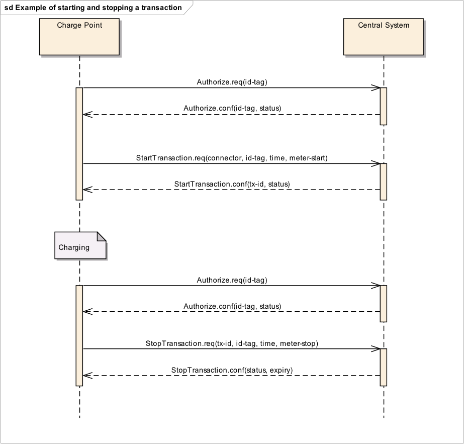
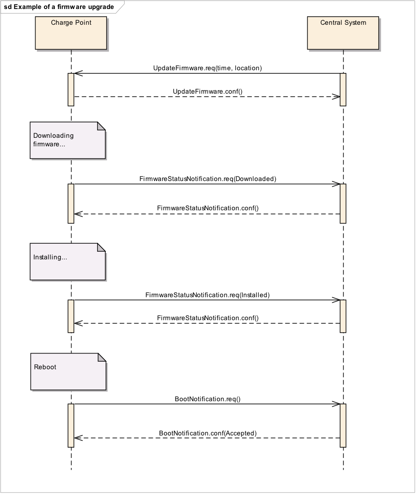
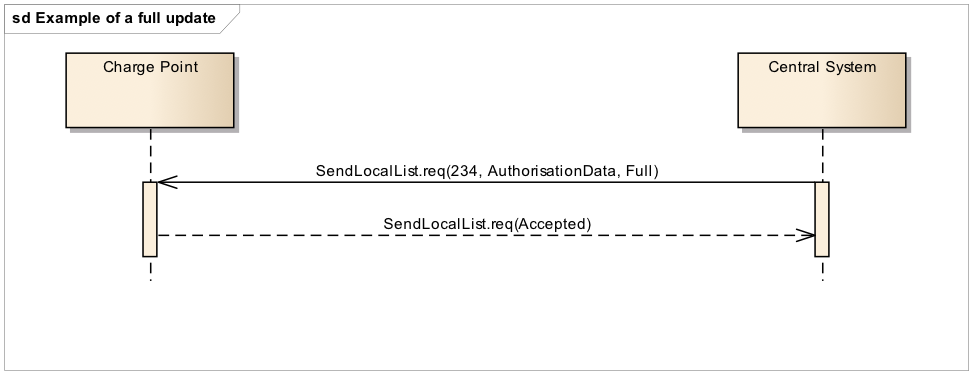
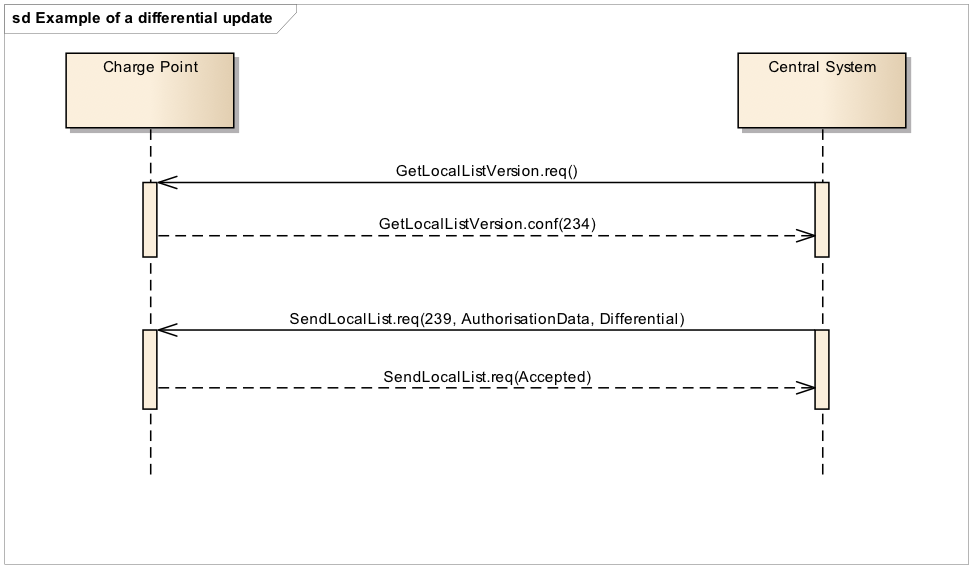
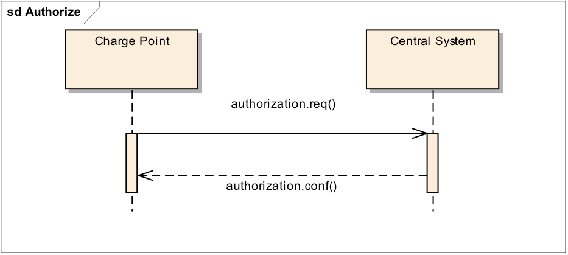

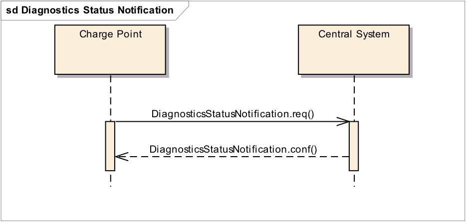
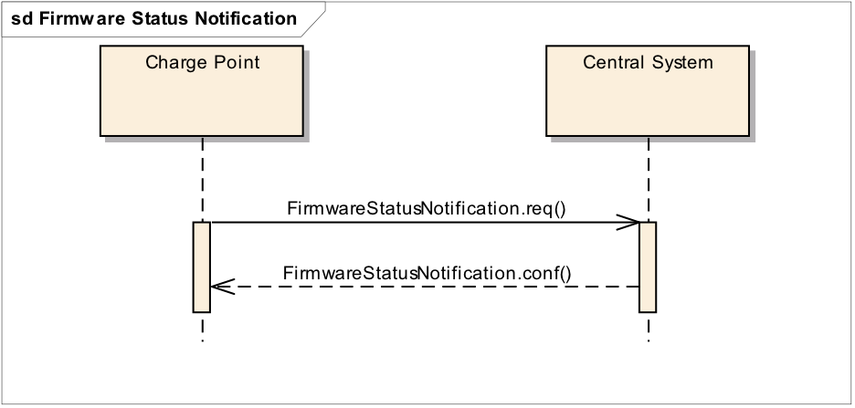
.. |image9| image:: media/image10.png
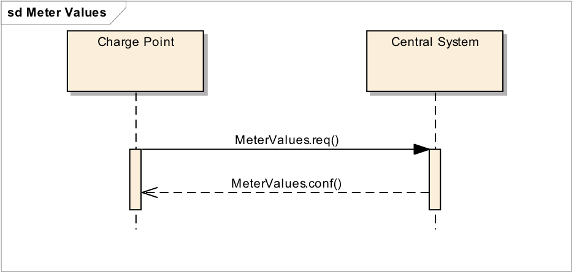
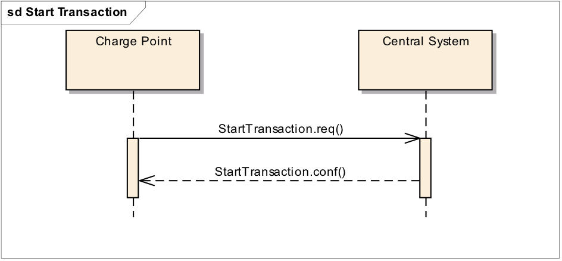
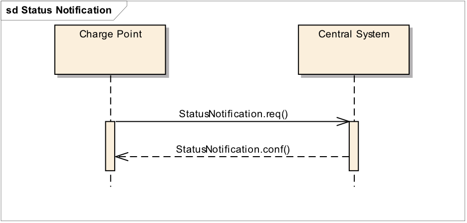
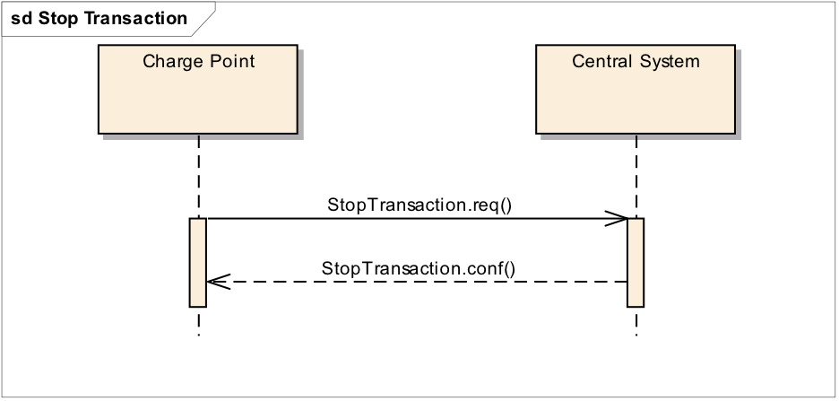
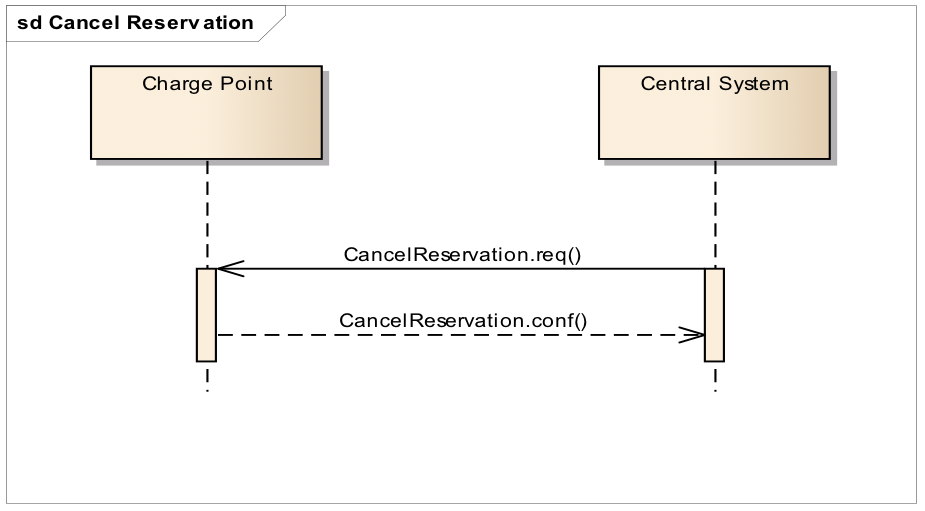
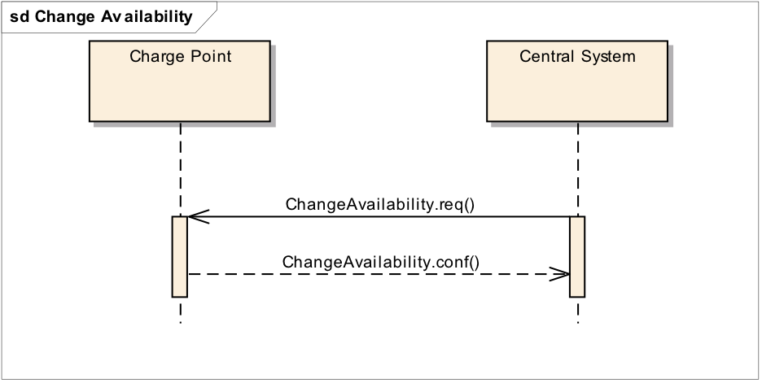
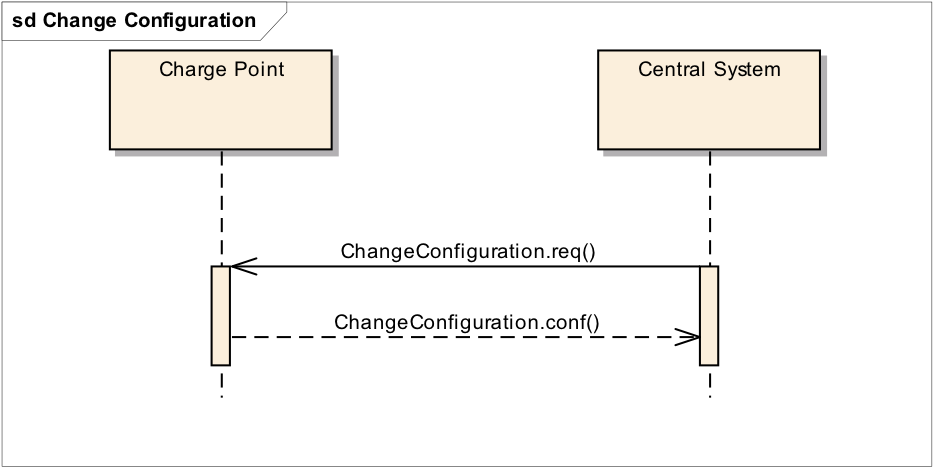

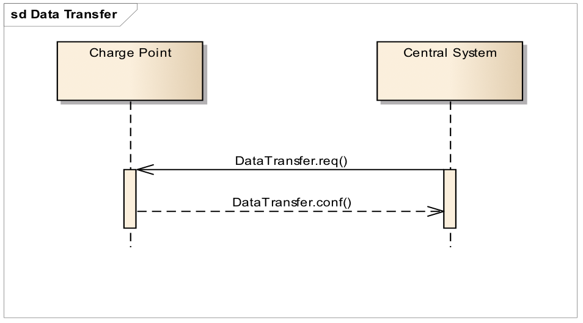
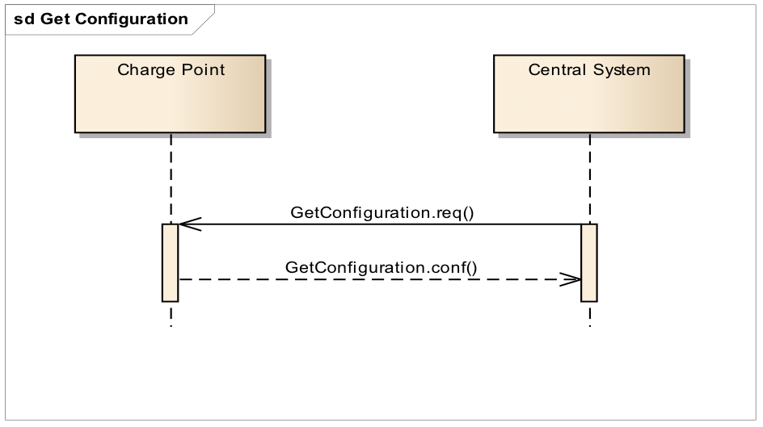

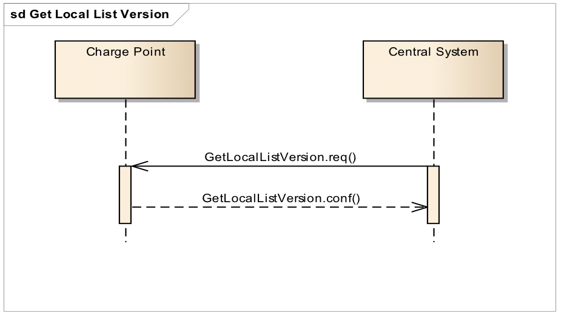
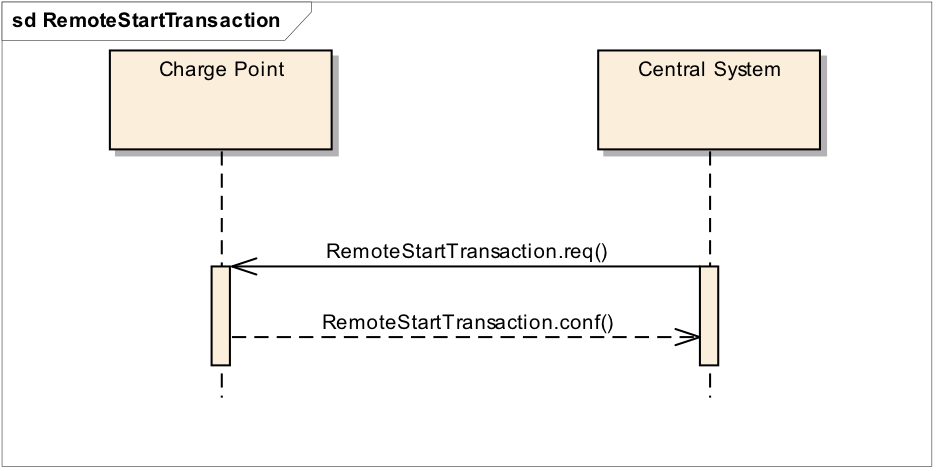
.. |image23| image:: media/image24.png

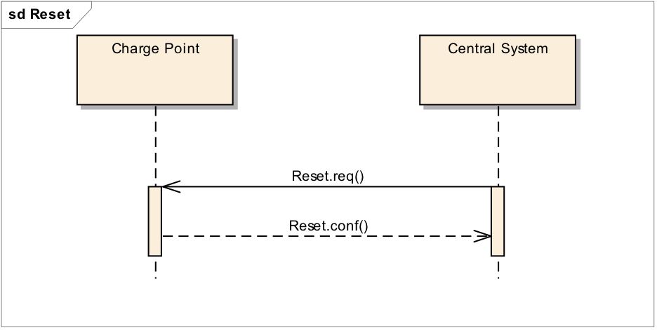

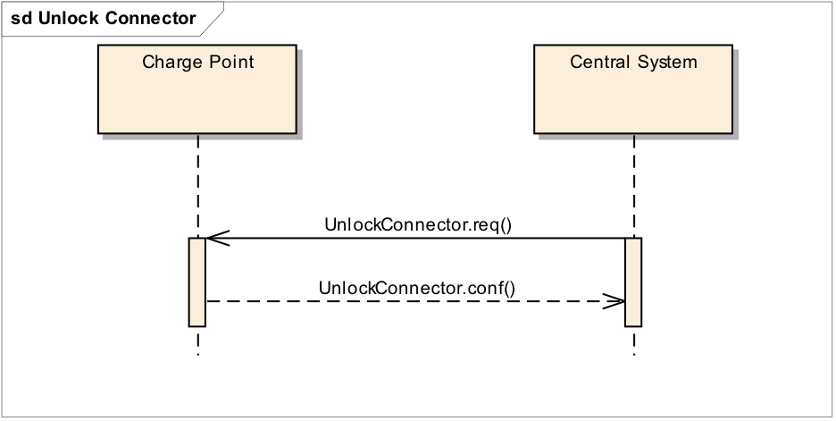

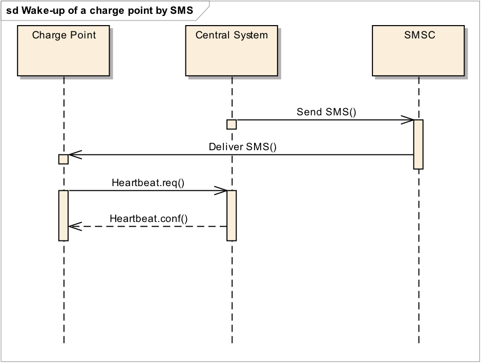
